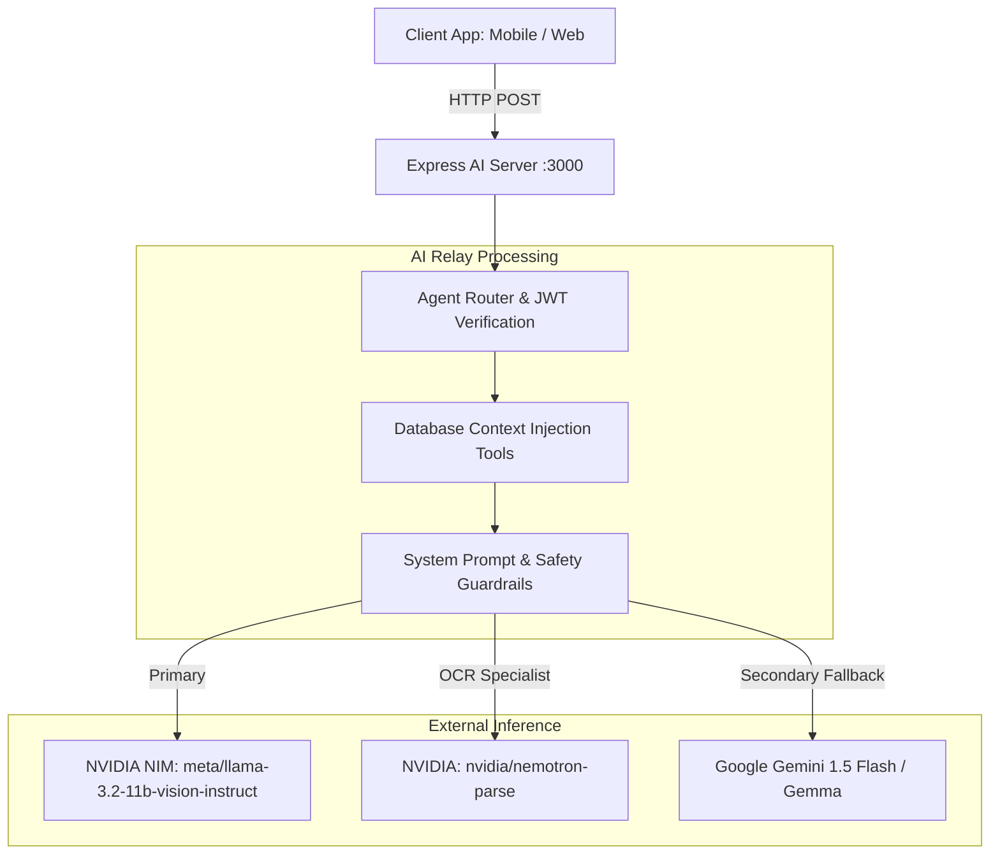
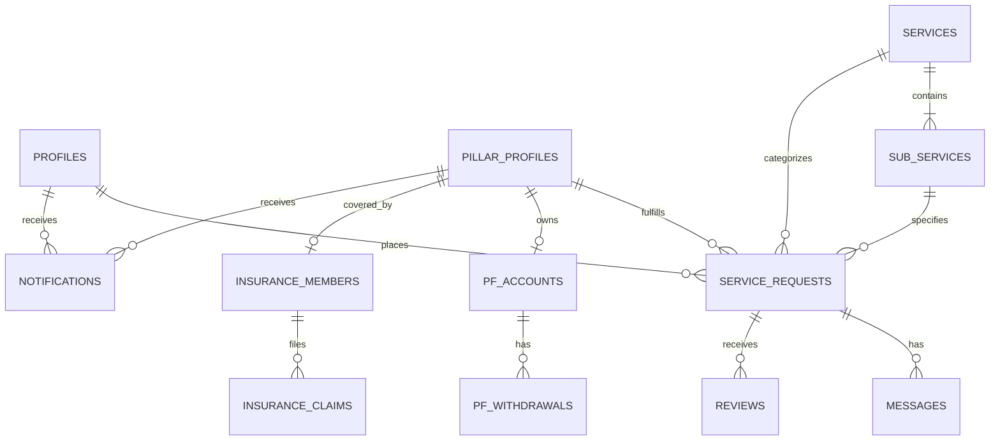

# COOP HUB — Mobile Migration Handoff

> **Official Technical Baseline & Handoff Document for Mobile Engineering Phase**  
> **Target Mobile Stack:** React Native • Expo (SDK 52+) • Expo Router • TypeScript • EAS Build  
> **Scope:** Customer Mobile App & Pillar Technician Mobile App (Admin Console remains Web-Only)

---

## 1. Project Overview

**COOP HUB** is a cooperative on-demand home service management platform. It connects residential and commercial consumers with verified, certified cooperative service technicians ("Pillars") across key trades (Electrical, Plumbing, AC Repair, Appliance Maintenance, Carpentry, Painting, Caregiving, and Emergency Services).

### Upcoming Architecture Transition

The project is entering its next phase: migrating the user-facing Customer and Pillar experiences to a **single unified native mobile codebase** built with **React Native and Expo**, while maintaining the **Cooperative Admin Console on the Web**.

```
COOP HUB Architecture
├── Web Application
│   └── Cooperative Admin Console (Operations, KYC Clearance, Dispatch, Finance, Telemetry)
│
├── Mobile Application (React Native + Expo)
│   ├── Customer Portal (Discovery, Booking, Real-Time Tracking, Arrival OTP, Chat, Invoices)
│   └── Pillar Technician Portal (Job Dispatch, Doorstep OTP, In-Progress Workflow, Wallet, PF & Welfare)
│
└── Shared Backend & Cloud Services
    ├── Supabase (PostgreSQL, Auth, Row-Level Security, Realtime Subscriptions, Storage)
    ├── Express AI Relay Backend Server (`server/server.js`)
    ├── Multi-Model AI (NVIDIA NIM Llama 3.2 Vision / Nemotron & Google Gemini)
    ├── KYC & Document Processing (Tesseract OCR / NVIDIA Document AI / Vision Extraction)
    ├── Geolocation, Routing & Distance Engines
    ├── Dynamic Multilingual Engine (Targeting all 22 Scheduled Indian Languages)
    └── Push Notifications & Lifecycle Event Hub
```

> **IMPORTANT ARCHITECTURAL DIRECTIVES:**
> - The existing Web Application remains fully intact and functional.
> - The Mobile Application **IS NOT A WEBVIEW WRAPPER**. It will be constructed as a clean, high-performance React Native + Expo native application.
> - The Cooperative Admin Console **REMAINS EXCLUSIVELY ON WEB**.
> - The Mobile Application will directly reuse the Supabase database schema, RLS policies, backend Express microservices, AI inference endpoints, and data validation business logic.

---

## 2. Current Technology Stack

The following technologies, libraries, and versions have been verified in the repository:

### Core Frameworks & Runtime
- **Frontend Framework:** React `^19.1.0` (Web)
- **Frontend DOM:** `react-dom` `^19.1.0`
- **Build Tool & Bundler:** Vite `^6.3.0` (`@vitejs/plugin-react` `^4.5.0`)
- **Web Routing:** React Router DOM `^7.6.0`
- **Backend Server Runtime:** Node.js (ES Modules) with Express `^4.21.2`
- **Process Orchestration:** `concurrently` `^9.2.4`

### Database, Realtime & Storage
- **Backend-as-a-Service:** Supabase (`@supabase/supabase-js` `^2.49.0`)
- **Database Engine:** PostgreSQL (with `uuid-ossp` extension, Realtime Replication Publications)
- **Security & Access Control:** PostgreSQL Row Level Security (RLS) policies
- **File Storage:** Supabase Storage buckets (`documents`, `attachments`)

### Styling & UI Design System
- **CSS Framework:** Tailwind CSS `^3.4.17`, PostCSS `^8.5.0`, Autoprefixer `^10.4.20`
- **Design Tokens:** Vanilla CSS Custom Properties (`src/styles/variables.css`, `src/styles/global.css`, `src/index.css`)
- **Iconography:** Lucide React `^0.468.0`

### Motion & 3D Graphics
- **3D WebGL Engine:** Three.js `^0.185.1`
- **3D Asset Loaders:** `three/examples/jsm/loaders/GLTFLoader.js`
- **3D Animation:** Three.js `AnimationMixer`
- **Motion Animation:** GSAP `^3.15.0`

### AI, OCR & Document Processing
- **Vision & LLM Inference (Primary):** NVIDIA NIM API (`meta/llama-3.2-11b-vision-instruct`, `nvidia/nemotron-parse`)
- **Vision & LLM Inference (Secondary/Fallback):** Google Gemini 1.5 Flash / Gemma via REST endpoints
- **Client-Side OCR (Web):** Tesseract.js `^7.0.0`
- **PDF Extraction:** `pdfjs-dist` `^4.10.38`
- **Time-Series Forecasting:** Amazon Chronos-2 pipeline (`amazon/chronos-2`) with heuristic peak/trough mathematical modeling

### Multilingual & Audio
- **Localization Format:** JSON resource catalogs + `unifiedTranslations.js` (Currently covering English `en`, Tamil `ta`, Hindi `hi`, Telugu `te`, Kannada `kn`)
- **Speech Synthesis / Recognition (Web):** Browser Web Speech API (`window.speechSynthesis`, `webkitSpeechRecognition`)

---

## 3. Current Application Architecture

The application is structured into four primary layers:

```mermaid
graph TD
    subgraph Frontend Portals (Vite SPA)
        CP[Customer Portal: /home, /services, /requests]
        PP[Pillar Portal: /dashboard, /dashboard/orders, /dashboard/welfare]
        AP[Admin Console: /admin, /admin/pillars, /admin/welfare]
    end

    subgraph Express AI Relay Server (:3000)
        AIChat[/api/ai/chat]
        AIDoc[/api/ai/process-document]
        AIForecast[/api/ai/forecast/chronos]
        AIDemand[/api/ai/forecast/reason]
    end

    subgraph Supabase Cloud Infrastructure
        Auth[Supabase Auth JWT]
        DB[(PostgreSQL Database)]
        RT[Realtime Channels]
        Storage[Storage Buckets]
    end

    subgraph External AI Services
        NVIDIA[NVIDIA NIM Vision API]
        Gemini[Google Gemini API]
    end

    CP <--> Auth
    PP <--> Auth
    AP <--> Auth

    CP <--> DB
    PP <--> DB
    AP <--> DB

    CP <--> RT
    PP <--> RT
    AP <--> RT

    CP --> AIChat
    PP --> AIDoc
    AP --> AIForecast
    AP --> AIDemand

    AIChat --> NVIDIA
    AIChat --> Gemini
    AIDoc --> NVIDIA
    AIDoc --> Gemini
```

### Communication Patterns
1. **Authentication & Session Management:** `src/context/AuthContext.jsx` interfaces with `supabase.auth`. Includes dual-mode demo bypass hooks (`coophub_demo_customer`, `coophub_demo_user`, `coophub_demo_admin`) for interactive testing without active Supabase credentials.
2. **Realtime Pub/Sub:** `supabase.channel` listens to database inserts/updates on `service_requests`, `notifications`, `messages`, and `pillar_profiles`.
3. **AI Relay Server:** Browser frontends send authenticated JWT tokens to `http://localhost:3000/api/ai/*`. The Express server acts as an AI proxy, injecting live database context through sub-agent tools before querying NVIDIA NIM or Google Gemini.
4. **Service Request Matching:** `src/services/ai/matchingService.js` scores registered pillars based on trade skill tags, availability, geographic proximity (Haversine formula), star rating, and historical job completions.

---

## 4. Customer Portal — Current Status

| Feature / Screen | Web Route | Implementation Status | Evidence / Notes |
| :--- | :--- | :--- | :--- |
| **Root Portal Selector** | `/` | `IMPLEMENTED` | Role card selector with direct routes to Customer, Pillar, and Admin entry points. |
| **Customer Registration** | `/register` | `IMPLEMENTED` | Form validation, password confirmation, Supabase auth signup, demo fallback. |
| **Customer Login** | `/login` | `IMPLEMENTED` | Email/password login, demo credentials button, OTP mode toggle, field guide. |
| **Customer Home Dashboard** | `/home` | `IMPLEMENTED` | Active request cards, quick service categories, real-time unread alerts. |
| **Service Catalogue & Search** | `/services` | `IMPLEMENTED` | Live database lookup, trade category filtering, search input filter. |
| **Service Details & Sub-Services** | `/services/:id` | `IMPLEMENTED` | Sub-service pricing table, direct general booking fallback, back navigation. |
| **Multi-Step Service Booking** | `/services/:id/request` | `IMPLEMENTED` | 4-step wizard: address, map picker, date/time, description, attachments. |
| **AI Technician Auto-Dispatch** | `/services/:id/request` | `IMPLEMENTED` | Calls `matchingService.matchWorkforceForRequest`, auto-assigns top pillar. |
| **Active Requests Queue** | `/requests` | `IMPLEMENTED` | Status badges (`pending`, `assigned`, `on_the_way`, `in_progress`, etc.). |
| **Request Details & Stepper** | `/requests/:id` | `IMPLEMENTED` | Timeline stepper, technician ETA, arrival OTP card, bill breakdown. |
| **Arrival OTP Verification** | `/requests/:id` | `IMPLEMENTED` | 6-digit OTP generated upon booking, verified by Pillar upon arrival. |
| **Extra Charge Approval Banner** | `/requests/:id` | `IMPLEMENTED` | Displays additional material charges with customer Accept / Reject actions. |
| **Direct Technician Messaging** | `/requests/:id/chat` | `IMPLEMENTED` | Two-way chat with Supabase realtime subscription and message history. |
| **Live Geolocation Tracking** | `/requests/:id` | `PARTIALLY IMPLEMENTED` | Renders coordinates and map canvas; real GPS simulation requires live device. |
| **Payment Flow** | `/requests/:id` | `MOCK/DUMMY` | Modal displays payment breakdown and simulates instant UPI / Card success. |
| **GST Invoice / Bill Receipt** | Common Modal | `IMPLEMENTED` | Printable modal with itemized tariff, materials, CGST/SGST, and receipt number. |
| **Customer Service History** | `/history` | `IMPLEMENTED` | Lists completed/cancelled orders with invoice download and review trigger. |
| **Customer Review & Ratings** | `/history` / Modal | `IMPLEMENTED` | 1–5 star rating + text feedback submitted to `reviews` table. |
| **Notifications Center** | `/notifications` | `IMPLEMENTED` | Notification list with unread badge counter, mark-as-read, and header sync. |
| **Customer Profile** | `/profile` | `IMPLEMENTED` | Edit name, mobile number, email, and saved home address coordinates. |
| **Customer Settings** | `/settings` | `IMPLEMENTED` | Language selector, notification preference toggles, theme toggle. |
| **Helpdesk & Support Center** | `/support` | `IMPLEMENTED` | FAQ accordion, open new ticket form, support ticket history table. |
| **CoopBot Conversational AI** | Global Drawer | `IMPLEMENTED` | Realtime voice/text assistant connected to backend AI Relay Server. |

---

## 5. Pillar Portal — Current Status

| Feature / Screen | Web Route | Implementation Status | Evidence / Notes |
| :--- | :--- | :--- | :--- |
| **Pillar Portal Landing** | `/pillar` | `IMPLEMENTED` | Dedicated benefits landing page with direct dashboard access. |
| **Pillar Login** | `/pillar/login` | `IMPLEMENTED` | Pillar ID (`PIL-CHE-042`) or email + password, demo login bypass. |
| **4-Step KYC Registration** | `/pillar/register` | `IMPLEMENTED` | Multi-step: 1. Personal, 2. Trade Skills, 3. Government ID, 4. Trade Certificate. |
| **Client Document OCR** | `/pillar/register` | `IMPLEMENTED` | Tesseract.js extracts document number, name, DOB from uploaded ID scan. |
| **Server Vision AI KYC** | `/pillar/register` | `IMPLEMENTED` | Backend calls NVIDIA Nemotron / Gemini for structured document parsing. |
| **Pillar Dashboard** | `/dashboard` | `IMPLEMENTED` | KPI cards (Today's Jobs, Earnings, Rating), online/offline toggle, order list. |
| **Online Availability Switch** | `/dashboard` / Sidebar | `IMPLEMENTED` | Toggles `is_available` boolean in `pillar_profiles` table. |
| **Live Booking Queue** | `/dashboard/orders` | `IMPLEMENTED` | Tabbed views (`pending`, `in_progress`, `completed`). Realtime sync. |
| **Accept / Reject Job Flow** | `/dashboard/orders` | `IMPLEMENTED` | Pillar can accept pending assigned requests or reject with reason. |
| **Doorstep Arrival OTP Verify** | `/dashboard/orders` | `IMPLEMENTED` | Pillar enters customer's 6-digit OTP to transition status to `in_progress`. |
| **Extra Charge Proposal Modal** | `/dashboard/orders` | `IMPLEMENTED` | Pillar inputs additional material/repair cost and reason for customer approval. |
| **Finalize Bill & Complete** | `/dashboard/orders` | `IMPLEMENTED` | Itemizes labor + materials, calculates GST (18%), generates receipt number. |
| **Customer Chat** | `/dashboard/chat` | `IMPLEMENTED` | Active customer chat list, message dispatch, realtime channel listener. |
| **Earnings & Wallet** | `/dashboard/earnings` | `IMPLEMENTED` | Revenue metrics, payout request action, transaction history table. |
| **Bank Account Linking** | `/dashboard/profile` | `IMPLEMENTED` | Bank name, Account Number, IFSC code, and UPI ID saved to profile. |
| **Job History & Ratings** | `/dashboard/history` | `IMPLEMENTED` | Historical completed job list with customer star ratings and feedback. |
| **Trade Certifications Dossier**| `/dashboard/certifications`| `IMPLEMENTED` | Upload trade credentials, view verification badge and matching boost score. |
| **Provident Fund (PF) Shield** | `/dashboard/welfare` | `IMPLEMENTED` | Cooperative PF balance, 50:50 worker/coop share breakdown, withdrawal modal. |
| **Group Health Insurance** | `/dashboard/welfare` & `/insurance` | `IMPLEMENTED` | Master policy details, coverage validity, claim submission and tracker. |
| **Government Schemes Directory**| `/dashboard/welfare` | `IMPLEMENTED` | Reference directory for PMJJBY, PMSBY, Ayushman Bharat, TN Labour Welfare. |
| **Pillar Notifications** | `/dashboard/notifications`| `IMPLEMENTED` | Realtime job dispatch alerts and system update notices. |
| **Pillar Settings** | `/dashboard/settings` | `IMPLEMENTED` | Multi-language preference selector, app configurations. |
| **Emergency Support Helpdesk** | `/dashboard/support` | `IMPLEMENTED` | Create support ticket, view dispute and grievance status. |

---

## 6. Admin Portal — Current Status

> **NOTE:** The Cooperative Admin Portal **REMAINS EXCLUSIVELY ON WEB**. It is not part of the mobile application migration scope.

| Feature / Screen | Web Route | Implementation Status | Evidence / Notes |
| :--- | :--- | :--- | :--- |
| **Admin Secure Login** | `/admin/login` | `IMPLEMENTED` | Admin authentication gate with demo credentials mode. |
| **Operations Command Tower** | `/admin` | `IMPLEMENTED` | Platform GMV, active technician count, live orders chart, real-time alerts. |
| **Pillar Directory & Clearance** | `/admin/pillars` | `IMPLEMENTED` | Directory of registered technicians with status filters (`pending`, `verified`, `rejected`). |
| **Deep KYC & PaddleOCR Viewer** | `/admin/pillars/:id` | `IMPLEMENTED` | Side-by-side document image preview, OCR transcription, AI confidence score, one-click verify/reject. |
| **Live Dispatch & Requests** | `/admin/requests` | `IMPLEMENTED` | Filterable orders table, emergency job badges, manual technician reassignment. |
| **Geospatial Radar Tracking** | `/admin/tracking` | `PARTIALLY IMPLEMENTED` | Field radar displaying technician coordinates with map fallback. |
| **Predictive Demand Forecasting**| `/admin/forecast` | `IMPLEMENTED` | Amazon Chronos-2 probabilistic time-series forecasting + AI operational reasoning. |
| **Workforce Allocation Engine** | `/admin/allocation` | `IMPLEMENTED` | Trade shortfall matrix, demand vs supply analysis, allocation balancing. |
| **Cooperative Finance & Ledger** | `/admin/finance` | `IMPLEMENTED` | Platform commission tracking, tariff oversight, weekly payout processing. |
| **Welfare & PF Administration** | `/admin/welfare` | `IMPLEMENTED` | Cooperative PF pool ledger, withdrawal request approvals, insurance claim processing. |
| **Tariff & Catalogue Master** | `/admin/services` | `IMPLEMENTED` | Service category and sub-service CRUD, base price and active status configuration. |
| **Broadcast Messaging Center** | `/admin/messages` | `IMPLEMENTED` | Push notification broadcaster targeting All Users, Customers, or Pillars. |
| **Customer CSAT Analytics** | `/admin/feedback` | `IMPLEMENTED` | Quality metrics, customer ratings breakdown, technician performance review. |
| **Support Ticket Resolution** | `/admin/support` | `IMPLEMENTED` | Ticket queue, status updates (`open`, `in_progress`, `resolved`), reply dispatch. |
| **Trade Certification Clearance**| `/admin/certifications`| `IMPLEMENTED` | Review and verify skill credentials uploaded by technicians. |
| **Cooperative Admin Settings** | `/admin/settings` | `IMPLEMENTED` | Platform parameters, emergency routing, SLA thresholds. |
| **Admin AI Operational Chat** | `/admin/chatai` | `IMPLEMENTED` | Conversational analytics interface powered by backend AI relay. |

---

## 7. Shared Backend & Database

The backend architecture consists of a **Supabase PostgreSQL instance** and an **Express.js AI Relay Server**. Both will be shared directly between the Web Admin Console and the new Mobile Application.

### Database Tables & Functions

| Table Name | Primary Purpose | Used By | Mobile Reusable? |
| :--- | :--- | :--- | :--- |
| `services` | Master catalogue of service categories | Customer, Pillar, Admin | **Yes (Direct Read/Sync)** |
| `sub_services` | Granular service offerings with base prices | Customer, Pillar, Admin | **Yes (Direct Read/Sync)** |
| `service_requests` | Core order lifecycle, status, location, OTP, billing | Customer, Pillar, Admin | **Yes (Full CRUD & Realtime)** |
| `pillar_profiles` | Technician credentials, KYC status, trade skills, GPS | Pillar, Admin, Matching | **Yes (Full Profile & Status)** |
| `profiles` | Customer user account metadata, phone, saved address | Customer, Admin | **Yes (Full Profile CRUD)** |
| `notifications` | In-app alerts, dispatch notices, system messages | Customer, Pillar, Admin | **Yes (Realtime Channel)** |
| `messages` | Direct customer-pillar chat messages per request | Customer, Pillar | **Yes (Realtime Channel)** |
| `reviews` | Customer ratings and feedback for completed jobs | Customer, Pillar, Admin | **Yes (Insert & Read)** |
| `support_tickets` | User helpdesk tickets and dispute resolution | Customer, Pillar, Admin | **Yes (Full CRUD)** |
| `pf_accounts` | Cooperative Provident Fund balances and ledgers | Pillar, Admin | **Yes (Read-Only on Mobile)** |
| `pf_withdrawals` | Worker PF withdrawal requests and approvals | Pillar, Admin | **Yes (Submit & Track)** |
| `insurance_members`| Group insurance coverage details and validity | Pillar, Admin | **Yes (Read-Only on Mobile)** |
| `insurance_claims` | Insurance claim submissions, documents, and status | Pillar, Admin | **Yes (Submit & Track)** |
| `government_welfare_schemes` | Curated public welfare scheme directory | Pillar, Admin | **Yes (Direct Read)** |
| `audit_logs` | Administrative and financial action audit trails | Admin | Web Only |

### Realtime Publications
- `notifications`: Realtime broadcast for incoming job allocations, chat notices, status updates.
- `service_requests`: Realtime synchronization of status changes (`assigned` → `accepted` → `on_the_way` → `arrived` → `in_progress` → `completed`).
- `pillar_profiles`: Realtime online/offline availability tracking and coordinate updates.
- `messages`: Live two-way chat streaming.

### Storage Buckets
- `documents`: Government identity cards (Aadhaar, PAN, Voter ID, Driving Licence) and Trade Skill Certificates.
- `attachments`: Customer service request photo attachments and invoice PDFs.

---

## 8. AI Architecture

The platform uses a hybrid multi-model architecture with strict server-side sandboxing:



### 1. Conversational AI Assistant (CoopBot)
- **Endpoint:** `POST /api/ai/chat`
- **Primary Model:** NVIDIA NIM `meta/llama-3.2-11b-vision-instruct`
- **Fallback Model:** Google Gemini 1.5 Flash (`gemini-3.6-flash` / `gemini-2.5-flash`)
- **Capability:** Sub-agent intent routing with tool execution (fetches active requests, recent history, notifications, and catalog context via authenticated Supabase client).

### 2. Document Extraction & KYC Understanding
- **Endpoint:** `POST /api/ai/process-document`
- **Extraction Model:** `nvidia/nemotron-parse` (with bounding-box tool call support)
- **Understanding & Validation Model:** Google Gemini / Gemma-4
- **Capability:** Parses Indian IDs (Aadhaar, PAN, Voter, DL) and Trade Certificates, extracts structured JSON fields, compares with registered profile, and calculates confidence scores (`HIGH`, `MEDIUM`, `LOW`).

### 3. Predictive Demand Forecasting & Workforce Allocation
- **Endpoint:** `POST /api/ai/forecast/chronos`
- **Model:** Amazon Chronos-2 probabilistic time-series pipeline (`p10`, `p50`, `p90` quantile outputs).
- **Endpoint:** `POST /api/ai/forecast/reason`
- **Capability:** Generates human-readable operational demand interpretation and technician allocation advice.

---

## 9. Multilingual & Speech System

### Current Status
- **Implemented UI Languages (5 Languages):**
  - English (`en`)
  - Tamil (`ta` — தமிழ்)
  - Hindi (`hi` — हिन्दी)
  - Telugu (`te` — తెలుగు)
  - Kannada (`kn` — ಕನ್ನಡ)
- **Implementation:** Static JSON translation dictionaries located in `src/i18n/*.json` coupled with `src/i18n/unifiedTranslations.js`.
- **Speech Synthesis & Recognition:** Browser Web Speech API (`SpeechRecognition`, `speechSynthesis`) in `src/components/ai/GlobalHeroAgent.jsx` and `src/components/pillar/ai/HeroInteractiveAgent.jsx`.

### Target Mobile Architecture: Centralized Dynamic Language & Speech Engine
For the native mobile app, the architecture will expand to support **all 22 Scheduled Indian Languages**:

1. Assamese (`as`)
2. Bengali (`bn`)
3. Bodo (`brx`)
4. Dogri (`doi`)
5. Gujarati (`gu`)
6. Hindi (`hi`)
7. Kannada (`kn`)
8. Kashmiri (`ks`)
9. Konkani (`kok`)
10. Maithili (`mai`)
11. Malayalam (`ml`)
12. Manipuri / Meitei (`mni`)
13. Marathi (`mr`)
14. Nepali (`ne`)
15. Odia (`or`)
16. Punjabi (`pa`)
17. Sanskrit (`sa`)
18. Santali (`sat`)
19. Sindhi (`sd`)
20. Tamil (`ta`)
21. Telugu (`te`)
22. Urdu (`ur`)

> **IMPORTANT ARCHITECTURAL RULE:**
> Do **NOT** create 22 independent static JSON files with hundreds of duplicate keys.
> The mobile app will implement a **Centralized Dynamic Translation & Speech Engine**:
> - Core UI vocabulary cached locally for common strings.
> - Dynamic AI-driven translation service for long descriptions, error notices, and conversational messages.
> - Native device TTS (`expo-speech`) and STT (`@react-native-voice/voice`) using native OS voice packs.

---

## 10. CoopBot / 3D AI Mascot

### Current Web Implementation
- **3D Engine:** Three.js `WebGLRenderer` in `src/components/hero3d/Hero3DCanvas.jsx`.
- **3D Asset:** `/public/assets/3d/CoopBot_Animated.glb` (22.6 MB binary glTF with embedded skeletal animations).
- **Blender Source:** `/3d-hero/CoopBot_3D_Hero.blend` (17.5 MB source file with armature and shape keys).
- **Animations:** `Action_Idle`, `Action_Speaking`, `Action_Greeting`, `Action_Listening`, `Action_Thinking`, `Action_Success`, `Action_Error`.
- **Procedural Kinematics:** Procedural gaze tracking (head yaw/pitch lerping to cursor, eye bone rotations).
- **Dynamic Visor Screen:** 2D canvas texture projected onto a curved visor geometry on the head bone to render animated eye blinks and speech mouth open/close cycles.

### Mobile Migration Strategy for CoopBot
- High-poly WebGL models (22MB+) with procedural canvas textures can cause frame drops and battery drain on low-end mobile devices.
- **Recommended Mobile Adaptation:**
  - Option A: Lightweight React Native 3D rendering using `expo-gl` and `@react-three/fiber` with an optimized LOD (Level of Detail) GLB model (< 3MB).
  - Option B: High-performance 2D vector/Lottie animations for micro-interactions, paired with native audio feedback.
  - Option C: Standalone dedicated 3D interactive mascot sheet with lazy asset loading.

---

## 11. Native Mobile Migration Plan

The upcoming mobile development phase will build a clean **React Native + Expo** project inside the workspace.

### Technology Foundation
- **Framework:** React Native with Expo SDK 52+
- **Navigation:** Expo Router (File-based routing with native tabs and stack navigators)
- **Language:** TypeScript
- **State Management:** React Context + React Hooks (matching existing service patterns)
- **Build & Distribution:** EAS Build (Expo Application Services) for Android APK/AAB and iOS IPA

### What Will Be Reused Directly
- All Supabase database tables, schema definitions, and RLS policies.
- Supabase client integration logic (`@supabase/supabase-js`).
- Realtime channels and subscription handlers.
- Express AI Relay Backend (`server/server.js`) endpoints (`/api/ai/chat`, `/api/ai/process-document`, `/api/ai/forecast/*`).
- Business logic algorithms: `matchingService.js`, distance calculations (Haversine), billing breakdown formulas, OTP validation rules.

### What Must Be Rebuilt / Adapted for Native
- Web UI layouts (replace HTML `<div>`, CSS Flexbox with React Native `<View>`, `<Text>`, `<Pressable>`, `<ScrollView>`, `<FlatList>`).
- Web browser APIs (`window.location`, `localStorage`, `window.speechSynthesis`, `navigator.geolocation`) replaced with Expo native modules.
- Web file inputs (`<input type="file">`) replaced with `expo-image-picker` and `expo-document-picker`.
- Web Maps replaced with `react-native-maps`.
- Browser alert/toast prompts replaced with native modals and haptic feedback (`expo-haptics`).

---

## 12. Customer → Mobile Screen Mapping

| Current Web Route | Target Mobile Screen (Expo Router) | Reusable Logic | Native Module Required | Status |
| :--- | :--- | :--- | :--- | :--- |
| `/login` | `app/(customer)/auth/login.tsx` | `supabase.auth.signInWithPassword`, OTP auth | `expo-secure-store` | Planned |
| `/register` | `app/(customer)/auth/register.tsx` | `supabase.auth.signUp`, profile creation | `expo-secure-store` | Planned |
| `/home` | `app/(customer)/(tabs)/index.tsx` | Service category query, active orders fetch | Native Pull-to-Refresh | Planned |
| `/services` | `app/(customer)/(tabs)/services.tsx`| `useServices.js`, catalogue filtering | `FlashList` / `FlatList` | Planned |
| `/services/[id]` | `app/(customer)/services/[id].tsx` | Sub-service query, price resolver | Native Stack Navigation | Planned |
| `/services/[id]/request` | `app/(customer)/booking/new.tsx` | Step wizard state, AI auto-dispatch | `expo-location`, `expo-image-picker` | Planned |
| `/requests` | `app/(customer)/(tabs)/requests.tsx`| `serviceRequestService.getRequests` | Native Tabs, Pull-to-Refresh | Planned |
| `/requests/[id]` | `app/(customer)/requests/[id].tsx` | Order detail query, OTP display, status sync| `react-native-maps`, Realtime | Planned |
| `/requests/[id]/chat` | `app/(customer)/requests/[id]/chat.tsx`| `messages` table CRUD & realtime channel | `KeyboardAvoidingView`, Realtime | Planned |
| `/history` | `app/(customer)/(tabs)/history.tsx` | Completed requests query, review launcher | `expo-file-system`, `expo-sharing` | Planned |
| `/notifications` | `app/(customer)/notifications.tsx` | `notifications` table CRUD & unread sync | `expo-notifications` | Planned |
| `/profile` | `app/(customer)/(tabs)/profile.tsx` | `profiles` table CRUD | `expo-image-picker` | Planned |
| `/settings` | `app/(customer)/settings.tsx` | Language switcher, notification toggles | `expo-localization`, `i18n` | Planned |
| `/support` | `app/(customer)/support/index.tsx` | `support_tickets` table CRUD | Native Accordion / List | Planned |

---

## 13. Pillar → Mobile Screen Mapping

| Current Web Route | Target Mobile Screen (Expo Router) | Reusable Logic | Native Module Required | Status |
| :--- | :--- | :--- | :--- | :--- |
| `/pillar/login` | `app/(pillar)/auth/login.tsx` | `pillarAuthService.login` | `expo-secure-store` | Planned |
| `/pillar/register` | `app/(pillar)/auth/register.tsx` | 4-Step KYC state, OCR validation | `expo-camera`, `expo-image-picker` | Planned |
| `/dashboard` | `app/(pillar)/(tabs)/index.tsx` | KPI stats, availability switch, order stream | `expo-location` (background), Realtime | Planned |
| `/dashboard/orders` | `app/(pillar)/(tabs)/orders.tsx` | `orderService.js`, status transitions | Native Swipeable / Tab List | Planned |
| `/dashboard/orders/[id]`| `app/(pillar)/orders/[id].tsx` | OTP verification, extra charges, bill finalizer| `react-native-maps`, `expo-haptics` | Planned |
| `/dashboard/chat` | `app/(pillar)/(tabs)/chat.tsx` | Two-way message service, active threads | `KeyboardAvoidingView`, Realtime | Planned |
| `/dashboard/earnings` | `app/(pillar)/(tabs)/earnings.tsx`| `earningsService.js`, payout calculation | Native Chart / Summary View | Planned |
| `/dashboard/welfare` | `app/(pillar)/(tabs)/welfare.tsx` | `welfareService.js`, PF ledger, insurance | Native Document Downloader | Planned |
| `/dashboard/certifications`| `app/(pillar)/certifications.tsx`| `certificationService.js`, trade uploads | `expo-document-picker` | Planned |
| `/dashboard/history` | `app/(pillar)/history.tsx` | Historical jobs query, customer reviews | `FlatList` | Planned |
| `/dashboard/profile` | `app/(pillar)/profile.tsx` | `profileService.js`, bank details CRUD | Native Form / Secure Input | Planned |
| `/dashboard/settings` | `app/(pillar)/settings.tsx` | Language switcher, app preferences | `expo-localization` | Planned |
| `/dashboard/support` | `app/(pillar)/support.tsx` | `supportService.js`, ticket creation | Native Form View | Planned |

---

## 14. Native Device Capabilities

The following native hardware and platform capabilities must be integrated during the mobile build:

1. **Geolocation & Turn-by-Turn Routing (`expo-location`):**
   - Foreground and background location tracking for Pillars during active service dispatches.
   - Geofencing and arrival detection when approaching customer coordinates.
2. **Camera & Document Capture (`expo-camera`, `expo-image-picker`):**
   - High-resolution camera capture with auto-crop for KYC Identity cards (Aadhaar, PAN, Voter ID).
   - Document picker for PDF trade certifications.
3. **Push Notifications (`expo-notifications`):**
   - Background push notifications for incoming job dispatch requests, chat messages, extra charge approvals, and payment receipts via Expo Push Service / Firebase Cloud Messaging (FCM).
4. **Speech-to-Text & Text-to-Speech (`expo-speech`, `@react-native-voice/voice`):**
   - Native hardware microphone audio streaming for hands-free voice interaction in Indian languages.
   - Low-latency native TTS speech output.
5. **Secure Local Storage (`expo-secure-store`):**
   - Hardware-encrypted key storage for Supabase session tokens, refresh tokens, and biometric authorization keys.
6. **Haptic Feedback (`expo-haptics`):**
   - Tactile vibration patterns for job dispatches, OTP confirmation, and emergency alerts.
7. **Offline Persistence & NetInfo (`@react-native-community/netinfo`):**
   - Network connectivity monitoring with local offline caching for service queues when working in poor cellular coverage areas.

---

## 15. Database / Supabase Reuse Map



### Potential Schema Adaptations for Mobile
- **FCM Push Token Column:** Add `push_token TEXT` to `profiles` and `pillar_profiles` to support native push routing.
- **Device Telemetry:** Add `battery_level NUMERIC`, `app_version TEXT`, `os_platform TEXT` to `pillar_profiles` for field health monitoring.
- **Geospatial Indexes:** Add PostGIS `geography(Point, 4326)` columns to `pillar_profiles` and `service_requests` for spatial radius queries (e.g., `ST_DWithin`).

---

## 16. Environment Variables

The current repository uses the following environment variable names.

> **SECURITY DIRECTIVE:** Never write real secret values in documentation.

| Variable Name | Environment | Purpose | Security Classification |
| :--- | :--- | :--- | :--- |
| `VITE_SUPABASE_URL` | Frontend (Web) | Public Supabase project URL | Public Client Safe |
| `VITE_SUPABASE_ANON_KEY` | Frontend (Web) | Supabase client anon public key | Public Client Safe (RLS-Restricted) |
| `SUPABASE_URL` | Backend (Node.js) | Supabase project URL for server client | Server Environment |
| `SUPABASE_ANON_KEY` | Backend (Node.js) | Supabase anon key for server client | Server Environment |
| `SUPABASE_SERVICE_ROLE_KEY` | Backend (Node.js) | Supabase elevated admin key (if used) | **CRITICAL SERVER SECRET** |
| `VITE_NVIDIA_API_KEY` | Frontend (Web) | NVIDIA NIM API Key | **API SECRET (Flagged for Backend Proxy)** |
| `NVIDIA_API_KEY` | Backend (Node.js) | NVIDIA NIM API Key for AI relay server | Server Secret |
| `VITE_NVIDIA_MODEL` | Frontend / Backend | Model name (`meta/llama-3.2-11b-vision-instruct`)| Configuration |
| `VITE_GEMINI_API_KEY` | Frontend (Web) | Google Gemini API Key | **API SECRET (Flagged for Backend Proxy)** |
| `GEMINI_API_KEY` | Backend (Node.js) | Google Gemini API Key for AI relay server | Server Secret |
| `PORT` | Backend (Node.js) | Express AI server port (default: `3000`) | Configuration |

> **SECURITY ISSUE FLAGGED:**
> In the existing web frontend (`src/services/ai/aiService.js` and `src/lib/supabase.js`), fallback API keys are hardcoded in source files.
> **Mobile Migration Requirement:** In the mobile project, ALL API keys must be loaded exclusively via environment variables (`.env`) or securely proxied through the Express server. Never hardcode API keys into client bundles.

---

## 17. Known Bugs & Discovered Issues

| Bug ID | Current Behavior | Expected Behavior | Affected Area | Severity | Status |
| :--- | :--- | :--- | :--- | :--- | :--- |
| **BUG-001** | Hardcoded fallback API keys in client-side source code (`src/services/ai/aiService.js`, `src/lib/supabase.js`). | Keys should be sourced strictly from environment or backend proxy without client fallback strings. | Security / Config | `HIGH` | Discovered |
| **BUG-002** | Web Speech API (`webkitSpeechRecognition`) is unsupported in certain browsers and non-Chromium environments, causing silent audio input failure. | Graceful fallback or native speech recognizer should be used. | Web Voice Assistant | `MEDIUM` | Documented |
| **BUG-003** | 3D CoopBot GLB model (`CoopBot_Animated.glb`) is 22.6 MB, leading to long initial load times on slow mobile network connections. | Model should be compressed using Draco compression or optimized to < 3MB. | 3D Assets | `MEDIUM` | Documented |
| **BUG-004** | Dynamic Visor canvas texture for 3D character face expressions is tied to WebGL canvas dimensions and does not render if WebGL context is lost. | Context restoration listener and sprite/mesh fallback needed. | 3D Canvas | `LOW` | Documented |
| **BUG-005** | Customer payment flow simulates payment completion with static timeouts without communicating with an active payment gateway (Razorpay/UPI). | Real payment gateway webhook integration required for production. | Payment Flow | `MEDIUM` | Documented |

---

## 18. Mock / Placeholder / Incomplete Features

The following features currently contain prototype, demo, or placeholder logic:

1. **Payment Gateway Integration:**
   - Simulated with `setTimeout` in `src/services/customer/paymentService.js`.
   - Production will require Razorpay / Cashfree / UPI Intent SDK integration.
2. **Live GPS Telemetry:**
   - Simulated with coordinate offsets and interval updates in web browser mode.
   - Production mobile app will use real device GPS streams via `expo-location`.
3. **Demo Bypass Modes:**
   - `coophub_demo_customer`, `coophub_demo_user`, and `coophub_demo_admin` flags stored in `localStorage` allow local testing with static dummy data when Supabase connection is offline.
4. **Amazon Chronos-2 Python Service:**
   - Server attempts connection to `http://localhost:8000/predict`. If offline, it uses a local mathematical distribution fallback algorithm.
5. **Government Scheme Applications:**
   - Links in `/dashboard/welfare` direct to official government portal URLs for reference rather than executing direct state API filings.

---

## 19. Mobile Migration Risks & Mitigation

| Risk Area | Risk Description | Mitigation Strategy |
| :--- | :--- | :--- |
| **Background GPS Battery Drain** | Continuous high-accuracy GPS tracking on Pillar devices will rapidly deplete battery. | Implement adaptive distance intervals (`distanceInterval: 25`, `timeInterval: 15000`) and sleep tracking when inactive. |
| **22-Language Localization Load** | Loading 22 large translation bundles will bloat the mobile bundle size. | Use dynamic lazy-loading per selected language code and AI-powered translation for dynamic content. |
| **Document Upload File Size** | Camera photos on modern smartphones (5MB–15MB) cause upload timeouts and slow OCR. | Compress captured images on-device using `expo-image-manipulator` to max 1280px width and ~400KB before upload. |
| **Offline Job Execution** | Technicians frequently work in basements or rural areas without reliable 4G/5G signal. | Implement local SQLite / AsyncStorage caching for active job data, syncing changes once connectivity is restored. |
| **Push Notification Delivery** | Android OEM battery optimizations (MIUI, ColorOS) often kill background push listeners. | Use high-priority FCM data messages and register foreground push listeners with persistent channel configurations. |
| **App Store Compliance** | Google Play and Apple App Store require strict privacy disclosures for background location and camera access. | Prepare clear in-app permission explanation dialogs before requesting native OS permissions. |

---

## 20. Definition of Done (Mobile Migration)

The mobile migration will be considered **Complete** only when the following verifiable criteria are met:

### Customer Mobile Application
- [ ] User can register, verify phone, and log in with real Supabase authentication.
- [ ] Real service catalogue and sub-services load dynamically from PostgreSQL.
- [ ] User can place a service request with native device GPS address detection and photo attachments.
- [ ] AI workforce allocation matches and assigns an available certified technician in real time.
- [ ] Live tracking displays technician movement and dynamic ETA updates.
- [ ] 6-digit arrival OTP is displayed to customer and verified by technician before work begins.
- [ ] Two-way realtime messaging with technician works without polling.
- [ ] Extra charges proposed by technician appear as native action banners with approve/reject capabilities.
- [ ] Itemized invoice and receipt view renders with GST breakdown and PDF sharing.
- [ ] Service history and star rating feedback system writes directly to Supabase.
- [ ] Multi-language switching works smoothly across supported Indian languages.

### Pillar Technician Mobile Application
- [ ] Technician can register through 4-step KYC with native camera document capture and OCR validation.
- [ ] Online/offline availability switch updates status in real time.
- [ ] Incoming job dispatches trigger native push notifications and sound/vibration alerts.
- [ ] Technician can accept or reject jobs within deadline window.
- [ ] Doorstep OTP entry unlocks the service and transitions order to in-progress.
- [ ] Technician can submit extra material charges and finalize the bill.
- [ ] Wallet and earnings dashboard displays daily revenue, payout ledgers, and bank details.
- [ ] Welfare & Provident Fund dashboard displays cooperative contribution shares and withdrawal requests.
- [ ] Trade certifications can be uploaded via document picker with verification status badges.

### Quality & Performance Standards
- [ ] 100% Native React Native + Expo implementation (**Zero WebView wrappers**).
- [ ] Zero exposed API secrets in client bundles.
- [ ] All database reads and writes governed by PostgreSQL Row Level Security (RLS).
- [ ] Successful production APK/AAB build generated via EAS Build.
- [ ] Smooth 60 FPS UI transitions with zero crash logs during full booking lifecycle test.

---

## 21. Next Phase Roadmap

```
Phase 1: Complete Repository Audit & Technical Handoff [CURRENT COMPLETED PHASE]
   │
   ▼
Phase 2: Android & Expo Development Environment Setup
   │
   ▼
Phase 3: Initialize `mobile/` Workspace (React Native, Expo SDK 52+, Expo Router, TypeScript)
   │
   ▼
Phase 4: Customer Mobile Application Implementation
   │
   ▼
Phase 5: Pillar Technician Mobile Application Implementation
   │
   ▼
Phase 6: Native Hardware & OS Integrations (Camera, GPS, Push, Voice, Haptics)
   │
   ▼
Phase 7: End-to-End Realtime Lifecycle Testing & Validation
   │
   ▼
Phase 8: EAS Build & Production Android/iOS Packaging
```

> **NEXT IMMEDIATE STEP (Phase 2):**  
> Verify Android Studio, Java SDK, Node.js, and Expo CLI toolchain in the development environment before creating the `mobile/` application directory.
