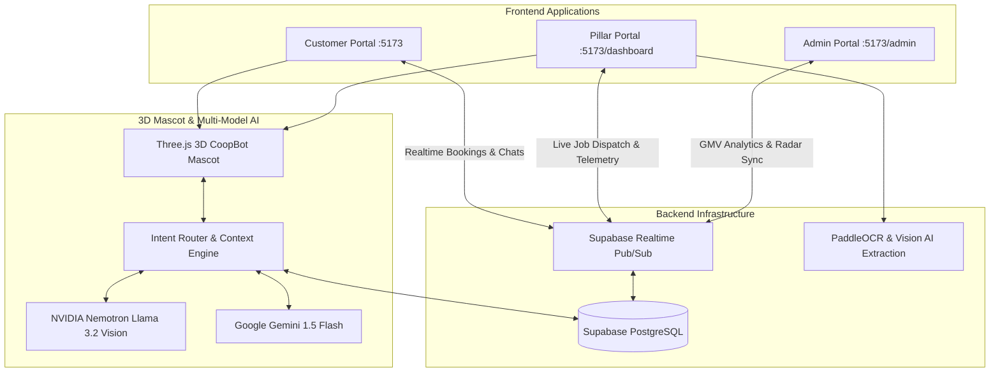

# 🏛️ COOP HUB — Unified Cooperative Multi-Portal Platform
### Customer Service Portal • Pillar Technician Platform • Cooperative Admin Operations Console

COOP HUB is an enterprise-grade, real-time cooperative service management ecosystem built with **React 19, Vite, Three.js 3D WebGL, Supabase PostgreSQL Realtime, and Multi-Model AI (NVIDIA Nemotron & Google Gemini)**. It empowers cooperative technicians (Pillars) with automated job dispatch and daily earnings, provides customers with verified on-demand home services, and equips cooperative administrators with real-time workforce telemetry and automated document verification.

---

## 🌟 Key Platform Innovations

### 1. 🤖 Interactive 3D Mascot Character — CoopBot
- **Full WebGL 3D Character**: High-performance Three.js rendering of CoopBot with skeletal animations (`Action_Idle`, `Action_Speaking`, `Action_Greeting`, `Action_Listening`, `Action_Thinking`, `Action_Success`, `Action_Error`).
- **Dynamic Visor Canvas & Kinematics**: Procedural visor screen displaying expressive eye blinks, emotional mouth shapes, real-time mouse look-at gaze tracking, and headset communication.
- **Uncaged Mascot Design**: Full uncropped 3D character standing proudly across both Customer and Pillar portals with zero artificial circle cropping frames.
- **Click-to-Expand Live AI Drawer**: Clicking CoopBot seamlessly expands an interactive conversational AI guide with voice synthesis (TTS) and speech-to-text (STT) mic input in **Tamil & English**.

### 2. ⚡ Real Multi-Model AI Intelligence (Zero Hardcoded Rule-Based Fallbacks)
- **Multi-Model Pipeline**: Powered by **NVIDIA Nemotron (`Llama 3.2 11B Vision Instruct`)** and **Google Gemini 1.5 Flash**.
- **Live Database Telemetry Injection**: Every AI prompt injects real-time Supabase database records:
  - Real technician booking queues and emergency orders.
  - Live technician earnings, pending payouts, and transaction ledgers.
  - Real-time customer requests, arrival OTP codes, and dispatch statuses.
  - Government welfare schemes (PMJJBY, PMSBY, Ayushman Bharat, TNUWWB).
- **Dedicated Sub-Agents**:
  - `customerAgent`: Real-time booking guidance, technician search, order tracking, and account preferences.
  - `authenticatedAgents`: Pillar order pipelines, financial summaries, dispatch tracking, and welfare assist.
  - `adminAgent`: Workforce clearance recommendations, GMV analytics, and dispute resolution.

### 3. 🔄 Realtime Bidirectional Database Synchronization
- Built on **Supabase PostgreSQL Realtime & Database Triggers**.
- When a customer books an electrician on `/services`, the request instantly broadcasts to the Pillar Dashboard on `/dashboard` and updates the Admin Dispatch Radar on `/admin/requests` in milliseconds.

---

## 🧭 Multi-Portal Sitemap & Routes

```
COOP HUB Architecture
│
├── 🛒 Customer Service Portal
│   ├── /                 ── Modern Landing Page with 3D Hero Mascot & Language Switcher
│   ├── /login            ── Customer Authentication with Side-by-Side 3D Mascot & Field Guidance
│   ├── /register         ── Customer Registration with Real-Time Field Focus Tracking
│   ├── /home             ── Customer Dashboard (Active Requests, Service Shortcuts, Full 3D Hero)
│   ├── /services         ── Category Catalog (Electrical, Plumbing, AC Repair, Carpentry, Painting)
│   ├── /requests         ── Live Service Queue & Arrival OTP Tracking
│   ├── /messages         ── Direct Technician Live Chat Interface
│   ├── /history          ── Completed Service Archives & Downloadable GST Invoices
│   ├── /support          ── 24/7 Customer Helpdesk & Ticket Center
│   ├── /settings         ── Language (EN/TA/HI/TE/KN), Notifications, and Security Options
│   └── /profile          ── Customer Profile & Saved Doorstep Delivery Addresses
│
├── 👥 Pillar Technician Portal
│   ├── /pillar           ── Dedicated Pillar Onboarding & Cooperative Benefits Landing
│   ├── /pillar/login     ── Pillar ID (PIL-CHE-042), Password & Mobile OTP Sign-in
│   ├── /pillar/register  ── 4-Step KYC Verification (Personal, Trade Skills, Government ID, Skill Certificate)
│   ├── /dashboard        ── Live Technician Control Center (Orders, Earnings, Availability Toggle, 3D Hero)
│   ├── /dashboard/orders ── Live Booking Queue, Arrival OTP Verification, Extra Parts Modal
│   ├── /dashboard/earnings ── Payout Wallet, Bank Account Linking, Weekly Settlements
│   ├── /dashboard/history  ── Completed Job Archives, Star Ratings, Customer Feedback
│   ├── /dashboard/chat     ── Two-Way Customer Messaging Center
│   ├── /dashboard/welfare  ── Cooperative Welfare Shield, Insurance Claims, PF Balance
│   ├── /dashboard/certifications ── Uploaded Trade Credentials & Verification Status
│   ├── /dashboard/profile  ── Verified Technician Dossier & Service Radius
│   └── /dashboard/support  ── Dispute Management & Emergency Helpline
│
└── 🏛️ Cooperative Admin Operations Console
    ├── /admin/login      ── Secure Administrative Entry
    ├── /admin            ── Operations Control Tower (Live GMV, Real-Time Radar, Telemetry)
    ├── /admin/pillars    ── Workforce Directory with Auto-Verification Clearance
    ├── /admin/pillars/:id ── Deep Technician Inspection & PaddleOCR Document Viewer
    ├── /admin/services   ── Tariff Master & Service Catalog Configuration
    ├── /admin/requests   ── Real-Time Service Dispatch & Technician Allocation
    ├── /admin/tracking   ── Geospatial Radar with Live Field GPS Tracking
    ├── /admin/forecast   ── AI Predictive Demand & Service Heatmap Forecasts
    ├── /admin/finance    ── Cooperative Ledger, Revenue Share, Commission Payouts
    ├── /admin/welfare    ── Member Welfare Schemes & Benefit Disbursements
    ├── /admin/customers  ── Customer Registry & Booking Histories
    ├── /admin/messages   ── Targeted Broadcast Center for Pillars & Customers
    ├── /admin/feedback   ── Customer CSAT Analytics & Quality Assurance
    └── /admin/settings   ── Cooperative Operating Parameters & Emergency Routing
```

---

## ⚡ System Architecture



---

## 🛠️ Technology Stack

| Layer | Technologies |
| :--- | :--- |
| **Frontend Framework** | React 19, React Router v7, Vite |
| **3D Rendering & Mascot** | Three.js WebGL, GLTFLoader, Dynamic Visor 2D Canvas Overlay, AnimationMixer |
| **Motion & Aesthetics** | GSAP (GreenSock Animation Platform), Framer Motion, Vanilla CSS Custom Tokens |
| **Realtime Database** | Supabase (PostgreSQL), Supabase Realtime Channels, Row-Level Security (RLS) |
| **AI Intelligence** | NVIDIA NIM API (`meta/llama-3.2-11b-vision-instruct`), Google Gemini 1.5 Flash |
| **Document Processing** | PaddleOCR Vision Engine, Automated KYC Verification Pipeline |
| **Localization** | Multi-Language Engine (`en`, `ta`, `hi`, `te`, `kn`) with Real-Time Web Speech API |
| **Icons & Visuals** | Lucide React, Custom SVG Icons, High-Resolution 3D Character Assets |

---

## 🚀 Getting Started

### 1. Prerequisites
- **Node.js**: v18.0.0 or higher
- **npm**: v9.0.0 or higher
- **Supabase Account**: Connected PostgreSQL instance

### 2. Environment Configuration
Create a `.env` file in the root directory:
```env
# Supabase Backend Configuration
VITE_SUPABASE_URL=https://your-project.supabase.co
VITE_SUPABASE_ANON_KEY=your-supabase-anon-key

# Multi-Model AI API Keys
VITE_NVIDIA_API_KEY=your-nvidia-nim-api-key
VITE_NVIDIA_MODEL=meta/llama-3.2-11b-vision-instruct
VITE_GEMINI_API_KEY=your-google-gemini-api-key
```

### 3. Installation & Local Development
```bash
# Clone the repository
git clone https://github.com/ANUPRIYA2007/coophub.git
cd coophub

# Install dependencies
npm install

# Start local development server
npm run dev
```
The application will launch at **`http://localhost:5173`**.

---

## 🧪 Demo Credentials & Testing

| Role | Access URL | Credentials / Actions |
| :--- | :--- | :--- |
| **Customer Portal** | `http://localhost:5173/login` | Click **"⚡ Fill Demo Customer Credentials"** or enter `customer@coophub.in` |
| **Pillar Portal** | `http://localhost:5173/pillar/login` | ID: `PIL-CHE-042` \| Password: `password123` |
| **Admin Operations** | `http://localhost:5173/admin` | Direct access to Administrative Command Radar |
| **New Pillar KYC** | `http://localhost:5173/pillar/register` | Test 4-step onboarding with live Document Verification |

---

## 📄 License
This project is proprietary cooperative software developed for **COOP HUB Chennai**. All rights reserved.
