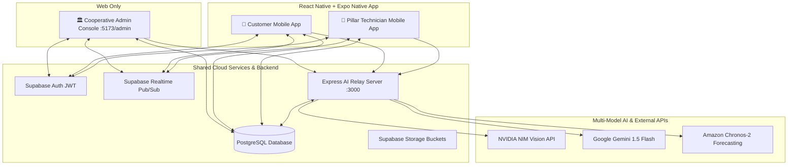

# 🏛️ COOP HUB — Unified Cooperative Platform

> **Cooperative On-Demand Services Ecosystem**  
> Web Admin Console • Customer Mobile App • Pillar Technician Mobile App • Shared Cloud Backend

---

## 📌 Platform Overview

**COOP HUB** is an enterprise-grade, real-time cooperative service management ecosystem. It empowers verified cooperative technicians (Pillars) with automated job dispatch, fair tariff earnings, and cooperative welfare benefits, while providing consumers with trusted, certified on-demand doorstep home services (Electrical, Plumbing, AC Repair, Appliances, Carpentry, Painting, Domestic Assistance, and Emergency Services).

The platform architecture is divided into three distinct operational interfaces backed by a centralized cloud infrastructure:

1. **🏛️ Web Admin Console (Web Only):** Operations control tower for cooperative administrators, handling KYC document verification, tariff management, real-time dispatch, geospatial workforce radar, predictive demand forecasting, finance, and welfare fund governance.
2. **🛒 Customer Mobile Application (React Native + Expo):** Native mobile app for consumers to discover services, place on-demand and scheduled bookings, track technician arrival in real time, verify doorstep arrival OTPs, chat with assigned technicians, approve extra charges, and submit ratings.
3. **👥 Pillar Technician Mobile Application (React Native + Expo):** Native mobile app for cooperative technicians to manage 4-step KYC onboarding, toggle online availability, receive real-time dispatch alerts, verify arrival OTPs, submit extra material expenses, manage daily earnings, and track Provident Fund (PF) and group health insurance benefits.
4. **☁️ Shared Backend & Cloud Services:** A unified Supabase PostgreSQL database with Row-Level Security (RLS), Realtime Pub/Sub channels, storage buckets, and an Express.js AI relay backend interfacing with NVIDIA NIM and Google Gemini.

> **NATIVE MOBILE APPLICATION DIRECTIVE:**  
> The upcoming mobile application is a **native React Native + Expo application**. It is **NOT a WebView wrapper**.

---

## 📊 Current Development Status

| Component | Platform | Current Implementation Status | Notes |
| :--- | :--- | :--- | :--- |
| **Cooperative Admin Console** | Web (Vite + React 19) | `IMPLEMENTED` | Full operations dashboard, KYC inspection, Chronos-2 forecasting, PF governance. |
| **Customer Web Portal** | Web (Vite + React 19) | `IMPLEMENTED` (Baseline for Mobile) | Full booking lifecycle, live chat, invoice generation, 3D CoopBot assistant. |
| **Pillar Web Portal** | Web (Vite + React 19) | `IMPLEMENTED` (Baseline for Mobile) | 4-step KYC, order lifecycle, arrival OTP, wallet, PF & insurance management. |
| **Shared Supabase Backend** | Cloud PostgreSQL | `IMPLEMENTED` | Relational tables, RLS policies, Realtime replication, document storage. |
| **AI Relay Microservice** | Node.js Express (:3000) | `IMPLEMENTED` | NVIDIA NIM & Gemini document extraction, chat router, demand forecasting. |
| **Customer Native Mobile App** | React Native + Expo | `PLANNED` (Phase 4) | Technical handoff complete (`MOBILE_HANDOFF.md`). Migration begins in next phase. |
| **Pillar Native Mobile App** | React Native + Expo | `PLANNED` (Phase 5) | Technical handoff complete (`MOBILE_HANDOFF.md`). Migration begins in next phase. |

---

## ⚡ System Architecture



---

## 📱 Mobile Technology Stack

The mobile application for Customers and Pillars will be engineered using:

- **Framework:** React Native with Expo SDK 52+
- **Navigation:** Expo Router (File-based typed routing with native Tab & Stack navigators)
- **Language:** TypeScript
- **State Management:** React Context & Custom Hooks
- **Hardware Integration:**
  - **Location & GPS:** `expo-location` (Foreground & background tracking)
  - **Camera & Scanning:** `expo-camera`, `expo-image-picker`
  - **File Picking:** `expo-document-picker`
  - **Push Notifications:** `expo-notifications` (FCM integration)
  - **Voice & Speech:** `expo-speech`, `@react-native-voice/voice`
  - **Encrypted Storage:** `expo-secure-store`
  - **Haptics:** `expo-haptics`
- **Build & CI/CD:** EAS Build (Expo Application Services) targeting Android (APK/AAB) and iOS (IPA)

---

## 🎯 Feature Areas

### 1. 🛒 Customer Experience
- Service catalogue discovery with fuzzy search and category filtering.
- Multi-step booking wizard with automated GPS location detection and attachment uploads.
- Intelligent AI technician allocation and auto-dispatch based on proximity and trade rating.
- Live order timeline with real-time status updates and 6-digit arrival OTP security.
- Direct in-app messaging with assigned technicians.
- Extra material charge approval workflow.
- Itemized GST invoice and receipt generation.
- Service history, star ratings, and feedback reviews.
- 24/7 Support ticket helpdesk and FAQ center.

### 2. 👥 Pillar Technician Experience
- Dedicated onboarding with 4-step KYC verification (Personal, Trade Skills, Government ID, Skill Certificate).
- Client-side and server-side OCR text extraction from Aadhaar, PAN, Voter ID, and Driving Licences.
- Real-time online/offline availability toggle.
- Interactive job queue (Pending, Accepted, In-Progress, Completed).
- Doorstep arrival verification via 6-digit customer OTP.
- Extra material and labor charge proposal modal.
- Daily earnings tracker, transaction ledger, and bank account linking.
- Cooperative Welfare Shield: Provident Fund (PF) balance, 50:50 contribution breakdown, and withdrawal requests.
- Group Health Insurance policy details and claim submission tracker.
- Trade certification uploads with administrative verification badges.

### 3. 🏛️ Cooperative Admin Operations (Web Only)
- Operations Command Tower with live platform GMV, active technician counts, and real-time orders radar.
- Deep KYC inspection viewer with side-by-side document image preview, OCR transcription, and AI confidence scores.
- Real-time service dispatch management with manual reassignment capabilities.
- Geospatial field radar with technician coordinates.
- Amazon Chronos-2 predictive demand forecasting and trade shortage allocation engine.
- Cooperative financial management, commission oversight, and weekly payout settlements.
- Welfare administration: PF pool governance, withdrawal approvals, and insurance claim processing.
- Broadcast messaging center targeting all users, customers, or technicians.
- Tariff master configuration and service catalogue management.

### 4. 🤖 AI, Multilingual & 3D Innovations
- **Multi-Model AI Relay:** NVIDIA NIM (`meta/llama-3.2-11b-vision-instruct`, `nvidia/nemotron-parse`) with Google Gemini 1.5 Flash fallback.
- **Interactive 3D Mascot (CoopBot):** Three.js WebGL character with skeletal animations, dynamic canvas visor expressions (eye blinks, speech mouth open/close), and conversational drawer.
- **Multilingual Engine:** English (`en`), Tamil (`ta`), Hindi (`hi`), Telugu (`te`), and Kannada (`kn`) currently supported; expanding to all **22 Scheduled Indian Languages** in the mobile Dynamic Language Engine.
- **Voice Capabilities:** Real-time speech synthesis (TTS) and speech-to-text (STT) mic input.

---

## 🧭 Multi-Portal Sitemap & Routes (Current Web Application)

```
COOP HUB Web Architecture
│
├── 🛒 Customer Service Portal
│   ├── /                 ── Modern Landing Page with 3D Hero Mascot & Language Switcher
│   ├── /login            ── Customer Authentication with Field Guidance
│   ├── /register         ── Customer Registration with Real-Time Validation
│   ├── /home             ── Customer Dashboard (Active Requests, Service Shortcuts)
│   ├── /services         ── Category Catalog (Electrical, Plumbing, AC Repair, Carpentry, Painting)
│   ├── /services/:id     ── Service Detail & Sub-Service Tariffs
│   ├── /services/:id/request ── Multi-Step Booking & AI Auto-Dispatch Wizard
│   ├── /requests         ── Live Service Queue & Arrival OTP Tracking
│   ├── /requests/:id     ── Request Details, Status Stepper & Receipt
│   ├── /requests/:id/chat── Direct Technician Live Chat Interface
│   ├── /history          ── Completed Service Archives & GST Invoices
│   ├── /support          ── 24/7 Customer Helpdesk & Ticket Center
│   ├── /settings         ── Language, Notifications, and Security Options
│   └── /profile          ── Customer Profile & Saved Delivery Addresses
│
├── 👥 Pillar Technician Portal
│   ├── /pillar           ── Dedicated Pillar Onboarding & Cooperative Benefits Landing
│   ├── /pillar/login     ── Pillar ID (PIL-CHE-042), Password & Mobile Sign-in
│   ├── /pillar/register  ── 4-Step KYC Verification with OCR Document Extraction
│   ├── /dashboard        ── Live Technician Control Center (Orders, Earnings, Availability Toggle)
│   ├── /dashboard/orders ── Live Booking Queue, Arrival OTP Verification, Extra Parts Modal
│   ├── /dashboard/earnings ── Payout Wallet, Bank Account Linking, Weekly Settlements
│   ├── /dashboard/history  ── Completed Job Archives, Star Ratings, Customer Feedback
│   ├── /dashboard/chat     ── Two-Way Customer Messaging Center
│   ├── /dashboard/welfare  ── Cooperative Welfare Shield, Insurance Claims, PF Balance
│   ├── /dashboard/certifications ── Uploaded Trade Credentials & Verification Status
│   ├── /dashboard/profile  ── Verified Technician Dossier & Service Radius
│   └── /dashboard/support  ── Dispute Management & Emergency Helpline
│
└── 🏛️ Cooperative Admin Operations Console (Web Only)
    ├── /admin/login      ── Secure Administrative Entry
    ├── /admin            ── Operations Control Tower (Live GMV, Real-Time Radar, Telemetry)
    ├── /admin/pillars    ── Workforce Directory with Auto-Verification Clearance
    ├── /admin/pillars/:id ── Deep Technician Inspection & PaddleOCR Document Viewer
    ├── /admin/services   ── Tariff Master & Service Catalog Configuration
    ├── /admin/requests   ── Real-Time Service Dispatch & Technician Allocation
    ├── /admin/tracking   ── Geospatial Radar with Live Field GPS Tracking
    ├── /admin/forecast   ── AI Predictive Demand & Service Heatmap Forecasts
    ├── /admin/allocation ── Workforce Shortfall Matrix & Rebalancing Engine
    ├── /admin/finance    ── Cooperative Ledger, Revenue Share, Commission Payouts
    ├── /admin/welfare    ── Member Welfare Schemes, PF Governance & Claims
    ├── /admin/customers  ── Customer Registry & Booking Histories
    ├── /admin/messages   ── Targeted Broadcast Center for Pillars & Customers
    ├── /admin/feedback   ── Customer CSAT Analytics & Quality Assurance
    ├── /admin/support    ── Helpdesk Ticket Resolution & Grievance Handling
    └── /admin/settings   ── Cooperative Operating Parameters & Emergency Routing
```

---

## 🛠️ Web Technology Stack

| Layer | Technologies |
| :--- | :--- |
| **Frontend Framework** | React 19, React Router v7, Vite |
| **3D Rendering & Mascot** | Three.js WebGL, GLTFLoader, Dynamic Visor 2D Canvas Overlay, AnimationMixer |
| **Motion & Aesthetics** | GSAP (GreenSock Animation Platform), Vanilla CSS Custom Tokens |
| **Realtime Database** | Supabase (PostgreSQL), Supabase Realtime Channels, Row-Level Security (RLS) |
| **AI Intelligence** | NVIDIA NIM API (`meta/llama-3.2-11b-vision-instruct`), Google Gemini 1.5 Flash |
| **Document Processing** | Tesseract.js OCR Engine, NVIDIA Nemotron Parse, PDF.js |
| **Localization** | Multi-Language Engine (`en`, `ta`, `hi`, `te`, `kn`) with Web Speech API |
| **Icons & Visuals** | Lucide React, Custom SVG Icons |

---

## 🗺️ Development Roadmap

```
Phase 1: Complete Repository Audit & Technical Handoff [COMPLETED]
   ├── Comprehensive repository inspection
   ├── Creation of MOBILE_HANDOFF.md
   └── Updating of README.md baseline
   │
   ▼
Phase 2: Android / Expo Development Environment Verification
   ├── Node.js, Java JDK 17+, Android Studio validation
   └── Expo CLI & EAS CLI verification
   │
   ▼
Phase 3: Initialize `mobile/` Workspace
   ├── Setup React Native with Expo SDK 52+
   ├── Configure Expo Router file-based routing
   └── Setup TypeScript, design tokens, and Supabase client
   │
   ▼
Phase 4: Customer Mobile Application Migration
   ├── Auth, Home, Category Discovery, Booking Wizard
   └── Realtime Order Tracking, Arrival OTP, Chat, Invoices
   │
   ▼
Phase 5: Pillar Technician Mobile Application Migration
   ├── 4-Step KYC Onboarding with Camera OCR
   └── Order Queue, OTP Verification, Earnings Wallet, PF & Insurance
   │
   ▼
Phase 6: Native Device Capabilities Integration
   ├── Background GPS, Push Notifications (FCM)
   └── Hardware Camera, Microphone Voice STT/TTS, Haptics
   │
   ▼
Phase 7: End-to-End Realtime Testing & Validation
   ├── Real booking lifecycle across Customer & Pillar apps
   └── RLS security and database integrity audit
   │
   ▼
Phase 8: Production EAS Build & Packaging
   └── Generating production Android APK/AAB and iOS builds
```

---

## 🚀 Getting Started (Web Platform)

### 1. Prerequisites
- **Node.js**: v18.0.0 or higher
- **npm**: v9.0.0 or higher
- **Supabase Account**: Connected PostgreSQL instance

### 2. Environment Configuration
Create a `.env` file in the root directory:
```env
# Supabase Backend Configuration
VITE_SUPABASE_URL=https://your-project.supabase.co
VITE_SUPABASE_ANON_KEY=your-supabase-anon-key

# Multi-Model AI API Keys
VITE_NVIDIA_API_KEY=your-nvidia-nim-api-key
VITE_NVIDIA_MODEL=meta/llama-3.2-11b-vision-instruct
VITE_GEMINI_API_KEY=your-google-gemini-api-key
```

### 3. Installation & Local Development
```bash
# Clone the repository
git clone https://github.com/ANUPRIYA2007/coophub.git
cd coophub

# Install dependencies
npm install

# Start local development server (Frontend + Backend Relay)
npm run dev
```
The application will launch at **`http://localhost:5173`**.

---

## 🧪 Demo Credentials & Testing (Web)

| Role | Access URL | Credentials / Actions |
| :--- | :--- | :--- |
| **Customer Portal** | `http://localhost:5173/login` | Click **"⚡ Fill Demo Customer Credentials"** or enter `customer@coophub.in` |
| **Pillar Portal** | `http://localhost:5173/pillar/login` | ID: `PIL-CHE-042` \| Password: `password123` |
| **Admin Operations** | `http://localhost:5173/admin` | Direct access to Administrative Command Tower |
| **New Pillar KYC** | `http://localhost:5173/pillar/register` | Test 4-step onboarding with live Document Verification |

---

## 📄 Documentation Reference
- **Mobile Migration Technical Handoff:** [`MOBILE_HANDOFF.md`](./MOBILE_HANDOFF.md)
- **Admin Portal Specification:** [`ADMIN_HANDOFF.md`](./ADMIN_HANDOFF.md)
- **AI Integration Report:** [`AI_INTEGRATION_CHANGE_REPORT.md`](./AI_INTEGRATION_CHANGE_REPORT.md)
- **Document KYC Implementation Report:** [`DEDICATED_DOCUMENT_KYC_IMPLEMENTATION_REPORT.md`](./DEDICATED_DOCUMENT_KYC_IMPLEMENTATION_REPORT.md)

---

## 📄 License
This project is proprietary cooperative software developed for **COOP HUB Chennai**. All rights reserved.
