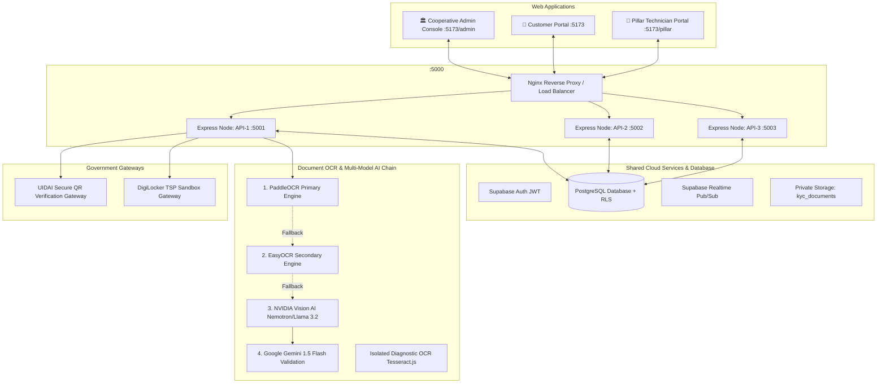

# 🏛️ COOP HUB — Unified Cooperative Platform

> **Enterprise On-Demand Doorstep Services Ecosystem**  
> Web Admin Console • Customer Web Portal • Pillar Technician Portal • Shared Cloud Backend • Multi-Model AI & OCR Pipeline

---

## 📌 Platform Overview

**COOP HUB** is an enterprise-grade, real-time cooperative service management ecosystem. It empowers verified cooperative technicians (Pillars) with automated job dispatch, fair tariff earnings, and cooperative welfare benefits, while providing consumers with trusted, certified on-demand doorstep home services (Electrical, Plumbing, AC Repair, Appliances, Carpentry, Painting, Domestic Assistance, and Emergency Services).

The platform architecture is divided into three distinct operational interfaces backed by a centralized cloud infrastructure:

1. **🏛️ Web Admin Console (Web Only):** Operations control tower for cooperative administrators, handling KYC document verification, tariff management, real-time dispatch, geospatial workforce radar, predictive demand forecasting, finance, and welfare fund governance.
2. **🛒 Customer Web Portal:** Progressive Web Application for consumers to discover services, place on-demand and scheduled bookings, track technician arrival in real time, verify doorstep arrival OTPs, chat with assigned technicians, approve extra charges, and submit ratings.
3. **👥 Pillar Technician Portal:** Dedicated mobile-responsive technician portal to manage 4-step KYC onboarding, toggle online availability, receive real-time dispatch alerts, verify arrival OTPs, submit extra material expenses, manage daily earnings, and track Provident Fund (PF) and group health insurance benefits.
4. **☁️ Shared Backend & Cloud Services:** A unified Supabase PostgreSQL database with Row-Level Security (RLS), Realtime Pub/Sub channels, private document storage, an Express.js backend cluster, and an explicit multi-model AI & OCR pipeline.

---

## 📊 Subsystem Operational Status Matrix

The platform strictly enforces the **Critical Truth Rule**: statuses reflect actual verified reality across environments:

| Subsystem / Layer | Implementation Status | Local Status | CI Pipeline Status | Staging Status | Production Status | Operational Evidence & Scope |
| :--- | :--- | :--- | :--- | :--- | :--- | :--- |
| **CI Pipeline** (`ci.yml`) | `IMPLEMENTED` | `LOCALLY VERIFIED` | `NOT EXECUTED` | `N/A` | `N/A` | 24-stage workflow covering lint, security, 16 test suites, Vite build, and Docker checks. |
| **CD Pipeline** (`cd.yml`) | `IMPLEMENTED` | `LOCALLY VERIFIED` | `NOT EXECUTED` | `NOT EXECUTED` | `NOT EXECUTED` | Multi-tier deployment with GHCR publishing, automated smoke tests, and rollback. |
| **High-Availability Load Balancer** | `IMPLEMENTED` | `LOCALLY VERIFIED` | `NOT EXECUTED` | `NOT EXECUTED` | `NOT EXECUTED` | Nginx round-robin upstream pool + 3 horizontal API instances (33/33/33% distribution & failover). |
| **Local Docker Engine** | `IMPLEMENTED` | `NOT CONFIGURED` | `NOT EXECUTED` | `N/A` | `N/A` | Docker CLI not installed on local host; container build validated inside GitHub Actions runner. |
| **Authoritative KYC Architecture** | `IMPLEMENTED` | `LOCALLY VERIFIED` | `NOT EXECUTED` | `NOT EXECUTED` | `NOT EXECUTED` | Zero mock records; dedicated pipelines for Aadhaar (Verhoeff), PAN, DL, Voter ID, and Skill Certs. |
| **UIDAI Secure QR Decoder** | `IMPLEMENTED` | `LOCALLY VERIFIED` | `NOT EXECUTED` | `N/A` | `N/A` | RFC 1951 Deflate decompression and RSA-2048 SHA-256 digital signature verifier. |
| **DigiLocker TSP Sandbox** | `IMPLEMENTED` | `LOCALLY VERIFIED` (8/8) | `NOT EXECUTED` | `NOT CONFIGURED` | `NOT EXECUTED` | Protected workflow (`digilocker-sandbox.yml`); local boundary tests passed; real sandbox not executed. |
| **Document OCR Provider Chain** | `IMPLEMENTED` | `LOCALLY VERIFIED` | `NOT EXECUTED` | `NOT EXECUTED` | `NOT EXECUTED` | PaddleOCR primary → EasyOCR secondary → NVIDIA Vision → Gemini. Tesseract isolated. |
| **AI Providers (NVIDIA & Gemini)** | `IMPLEMENTED` | `LOCALLY VERIFIED` | `NOT EXECUTED` | `NOT EXECUTED` | `NOT EXECUTED` | 2.5s timeouts, malformed JSON recovery, multi-tier fallback, and zero hallucination. |
| **Supabase Database & RLS** | `IMPLEMENTED` | `LOCALLY VERIFIED` | `NOT EXECUTED` | `NOT CONFIGURED` | `NOT CONFIGURED` | Strict RLS policies; service-role key never exposed to client-side code. |
| **Emergency Dispatch Operations** | `IMPLEMENTED` | `LOCALLY VERIFIED` (25/25) | `NOT EXECUTED` | `NOT EXECUTED` | `NOT EXECUTED` | Nearest technician matching, sequential offers, escalation, and audit logging. |
| **Financial Ledger & Split** | `IMPLEMENTED` | `LOCALLY VERIFIED` (18/18) | `NOT EXECUTED` | `NOT EXECUTED` | `NOT EXECUTED` | 91.5% Pillar / 8.5% Cooperative split, GST tax derivation, withdrawal ledger integrity. |
| **Welfare & Social Security** | `IMPLEMENTED` | `LOCALLY VERIFIED` (20/20) | `NOT EXECUTED` | `NOT EXECUTED` | `NOT EXECUTED` | Automated 2.5% matching PF contribution, welfare eligibility, and scheme directory. |
| **Native Mobile Applications** | `NOT IMPLEMENTED` | `N/A` | `N/A` | `N/A` | `N/A` | Platform is Web PWA; native iOS/Android codebase does not exist. |

---

## ⚡ System Architecture



---

## 🔬 Rebuilt Authoritative KYC & OCR Architecture

The KYC architecture follows a strict, authoritative-first verification model:

1. **User Statutory Consent**: Explicit opt-in, purpose, and timestamp recorded prior to document intake.
2. **Authoritative Government Gateways**:
   - **UIDAI Secure QR**: Decompresses byte payloads via RFC 1951 Deflate and verifies RSA-2048 SHA-256 signatures against public keys. Reports `PAYLOAD_DECODED_SIGNATURE_NOT_CONFIGURED` when keys are unconfigured.
   - **DigiLocker TSP Sandbox**: Supports configured TSPs (MeriPehchaan, Setu, Karza, Signzy). Reports `NOT_CONFIGURED` when credentials are absent; placeholder values are blocked.
3. **Explicit OCR Provider Chain**:
   ```
   PaddleOCR (Primary Engine)
     ↓ (if unconfigured or failed)
   EasyOCR (Secondary / Benchmark Engine)
     ↓ (if specialized OCR microservices unavailable)
   NVIDIA Vision AI (Nemotron Parse / Llama 3.2 Vision)
     ↓ (structuring & cross-checking)
   Gemini Flash (Reasoning & Inconsistency Detection)
   ```
   - **Zero Silent Tesseract Fallback**: Tesseract.js is strictly isolated behind `ALLOW_LEGACY_DIAGNOSTIC_OCR=true` for diagnostic use only. If production OCR engines fail, the system fails fast with `OCR_PROVIDERS_UNAVAILABLE` and routes to `MANUAL_REVIEW_REQUIRED`. Never fabricates missing fields.
4. **Document-Specific Validation Pipelines**:
   - **Aadhaar**: Verhoeff checksum algorithm + permanent first-8-digit masking (`XXXX-XXXX-1234`).
   - **PAN Card**: Format validation (`[A-Z]{5}[0-9]{4}[A-Z]`) + 4th character entity check (`P` required for individual technicians).
   - **Driving Licence**: Parivahan format verification + automated expiry detection.
   - **Voter ID**: Standard 10-character EPIC format verification.
   - **Skill Certificates**: Vocational trade synonym matching (e.g. Wireman → Electrician, HVAC → AC Mechanic).
5. **Quality, Consistency & Risk Engine**: Additive penalty scoring, cross-document discrepancy detection, and duplicate fingerprint collision detection.

---

## 🚀 CI/CD & Deployment Workflows

- **Continuous Integration (`.github/workflows/ci.yml`)**:
  - 24 sequential stages including Node 20 LTS, Python 3.11 minimal dependencies, lint, syntax check, type audit, 16 platform test suites, secret scanning, Vite production compilation, and Docker Buildx container validation.
- **Continuous Deployment (`.github/workflows/cd.yml`)**:
  - GHCR container image publishing, automated staging deployment, 12-point smoke test execution, protected production manual approval gate, and automated rollback controller (`scripts/rollback.mjs`).
- **Protected DigiLocker TSP Sandbox (`.github/workflows/digilocker-sandbox.yml`)**:
  - Dispatch-only protected workflow querying external TSP sandboxes via GitHub Secrets/Environment without polluting normal PR CI.

---

## 🛠️ Technology Stack

| Layer | Technologies |
| :--- | :--- |
| **Frontend Framework** | React 19, React Router v7, Vite 6 |
| **Styling & Design System** | Vanilla CSS Custom Design Tokens, CSS Grid/Flexbox |
| **Realtime Database** | Supabase (PostgreSQL 15), Realtime Publications, Row-Level Security (RLS) |
| **Backend Cluster** | Express.js (Node 20), Multi-Instance Process Pool, Nginx Reverse Proxy |
| **OCR Engines** | PaddleOCR (Primary), EasyOCR (Secondary), Tesseract.js (Isolated Diagnostic Only) |
| **AI Multi-Model Gateway** | NVIDIA NIM (`meta/llama-3.2-11b-vision-instruct`), Google Gemini 1.5 Flash |
| **Cryptographic Verification** | Node.js `crypto`, RFC 1951 Deflate (`zlib`), RSA-2048 SHA-256 verifier |
| **Testing & Quality** | 16 native Node/Python test suites (237 locally verified checkpoints, 100% pass) |

---

## 🧪 Local Test Execution

To execute the local test suites across all platform layers:

```bash
# Validate syntax and run security/secrets audit
npm run syntax:check
npm run lint

# Run Authoritative KYC & OCR suites
npm run test:kyc-ci
npm run test:kyc-rebuild
npm run test:kyc
npm run test:doc-intel
npm run test:ai-abstraction
npm run test:python-ocr
npm run test:digilocker-sandbox

# Run High Availability & Staging Smoke tests
npm run test:ha
npm run smoke:staging

# Run complete platform test suite (16 suites)
npm test

# Production Vite build
npm run build
```

---

## 📄 Documentation Index

- **[walkthrough.md](file:///C:/Users/hp/.gemini/antigravity-ide/brain/d58a5048-2dac-45e4-9c6c-c8af014e891b/walkthrough.md)**: Master gap closure, operational status audit, and remaining remediation items.
- **[docs/ENVIRONMENTS.md](file:///d:/coophub%20pillar%20dashboard/docs/ENVIRONMENTS.md)**: Environment separation matrix (Local, Test, Staging, Production).
- **[docs/BACKUP_RECOVERY.md](file:///d:/coophub%20pillar%20dashboard/docs/BACKUP_RECOVERY.md)**: Backup and Disaster Recovery runbook with RPO/RTO objectives.
- **[MOBILE_HANDOFF.md](file:///d:/coophub%20pillar%20dashboard/MOBILE_HANDOFF.md)**: API and architectural specifications for future native mobile client engineering.
- **[HANDOFF.md](file:///d:/coophub%20pillar%20dashboard/HANDOFF.md)**: Master production engineering handoff.
