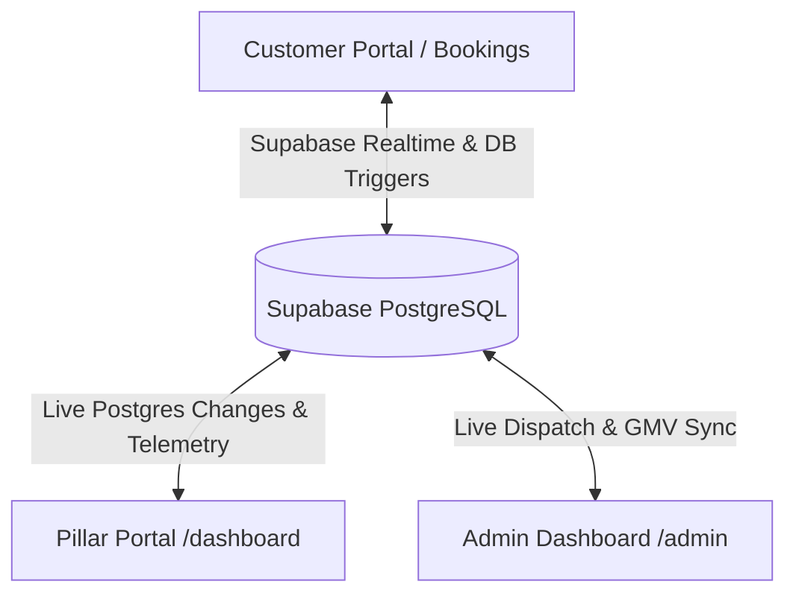

# 🏛️ COOP HUB — Unified Multi-Portal Platform
### Pillar Technician Portal & Cooperative Admin Intelligence Dashboard

This repository contains the completely configured React 19 (Vite) application for the **COOP HUB Pillar Portal** and the **Cooperative Admin Operations Console**. It features GSAP dynamic animations, multi-language localization (English, Tamil, Hindi, Kannada, Telugu), 24/7 AI Operations Intelligence (NVIDIA / Gemini powered), and **Supabase Realtime Live Synchronization** across Customer, Pillar, and Admin interfaces.

---

## 🧭 Multi-Portal Sitemap

### 1. 👥 Pillar Technician Portal
- `/` — Modern Customer/Pillar Landing Page with Interactive 3D Hero Mascot Agent
- `/login` — Secure OTP & Password Pillar Authentication with Demo Access bypass
- `/register` — 4-Step KYC Onboarding flow for new cooperative members
- `/dashboard` — Live Technician Control Center (Active Orders, Today's Earnings, Availability Toggle)
- `/dashboard/orders` — Orders pipeline with arrival OTP validation and extra charges modal
- `/dashboard/earnings` — Financial wallet with payout requests and transaction history
- `/dashboard/history` — Completed service archives and customer star ratings
- `/dashboard/chat` — Real-time customer messaging interface
- `/dashboard/profile` — Verified KYC credentials, trade licenses, and service radius
- `/dashboard/support` — Pillar helpdesk dispute ticket management

### 2. 🏛️ Cooperative Admin Dashboard
- `/admin` — Executive Operations Dashboard with live GMV, trade breakdown, and telemetry radar
- `/admin/pillars` — Workforce directory with technician verification approvals
- `/admin/pillars/:id` — Detailed technician dossier and KYC credentials
- `/admin/services` — Rate tariff manager and catalog master
- `/admin/requests` — Live service request dispatch tower
- `/admin/tracking` — Geospatial radar monitoring live field technician telemetry
- `/admin/feedback` — Customer CSAT review feed and 5-star sentiment analytics
- `/admin/messages` — Targeted broadcast composer and announcement center
- `/admin/support` — Multi-portal support desk resolution queue
- `/admin/settings` — Cooperative commission rates, emergency numbers, and payout cycles

---

## ⚡ 3-Portal Realtime Architecture



---

## 🚀 Local Development Setup

```bash
# Step 1: Install Dependencies (including GSAP & Lucide)
npm install

# Step 2: Start the AI Proxy Server (Port 3000)
node server/index.js

# Step 3: Start the Vite Development Server (Port 5173 / 5174)
npm run dev
```

---

## 🗄️ Database Migrations
Execute the SQL migration files in your Supabase SQL Editor in order:
1. `supabase/migrations/01_pillar_portal_schema.sql` — Core Pillar tables
2. `supabase/migrations/02_admin_portal_schema.sql` — Admin portal schema and services
3. `supabase/migrations/03_unified_coophub_realtime_schema.sql` — Realtime publication & bidirectional synchronization triggers

---

## 🧪 Demo Credentials
- **Pillar Demo Login**: ID: `PIL-CHE-042` | Password: `password123`
- **Admin Direct Route**: Access `/admin` directly in the browser
- **Real User Logins**: Authenticate with real Supabase credentials to view pure live database records with zero mocks.
