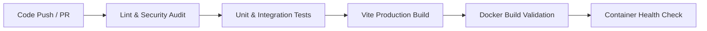

# COOP HUB — Production Infrastructure & Scalability Architecture

## 1. Executive Architectural Summary

COOP HUB employs a **high-availability Modular Monolith** architecture engineered for real-world resilience, horizontal scalability, zero-downtime deployments, and end-to-end data integrity.

The frontend is a reactive single-page application built with React and Vite, backed by an Express modular monolith API layer. Persistence, authentication, storage, and real-time state synchronization are governed by Supabase (PostgreSQL, Supabase Storage, and Supabase Realtime). All AI orchestration (NVIDIA NIM and Google Gemini with multi-tier failovers) is executed server-side to protect API keys and apply strict guardrails.

---

## 2. High-Level Architecture Diagram

```
      +-------------------+   +-----------------+   +---------------+
      |  Customer Mobile  |   |  Pillar Mobile  |   |   Admin Web   |
      +---------+---------+   +--------+--------+   +-------+-------+
                |                      |                    |
                +----------------------+--------------------+
                                       |
                                       v
                                   [ HTTPS ]
                                       |
                                       v
                     +-----------------------------------+
                     |        NGINX LOAD BALANCER        |
                     |  - Round-Robin Traffic Rotation   |
                     |  - Passive Health Failover (10s)  |
                     |  - WebSocket / SSE Upgrades       |
                     |  - X-Forwarded-* Headers          |
                     +-----------------+-----------------+
                                       |
            +--------------------------+--------------------------+
            |                          |                          |
            v                          v                          v
   +-----------------+        +-----------------+        +-----------------+
   |  API Instance 1 |        |  API Instance 2 |        |  API Instance 3 |
   |  [ INSTANCE_ID  |        |  [ INSTANCE_ID  |        |  [ INSTANCE_ID  |
   |    = api-1 ]    |        |    = api-2 ]    |        |    = api-3 ]    |
   |  Port: 5000     |        |  Port: 5000     |        |  Port: 5000     |
   |  Stateless      |        |  Stateless      |        |  Stateless      |
   +--------+--------+        +--------+--------+        +--------+--------+
            |                          |                          |
            +--------------------------+--------------------------+
                                       |
                                       v
                     +-----------------------------------+
                     |             SUPABASE              |
                     |  - PostgreSQL Database (RLS)      |
                     |  - Realtime WebSocket Engine      |
                     |  - Blob Storage (Encrypted KYC)   |
                     |  - Supabase JWT Auth Verification |
                     +-----------------+-----------------+
                                       |
                    +------------------+------------------+
                    |                                     |
                    v                                     v
          +-------------------+                 +-------------------+
          |  NVIDIA NIM API   |                 | Google Gemini API |
          |  (Llama-3.2 /     |                 | (Gemini-3 Flash   |
          |   Nemotron Parse) |                 |  Multimodal)      |
          +-------------------+                 +-------------------+
```

---

## 3. Modular Monolith Design & Horizontal Scaling

### Why Modular Monolith?
Rather than fragmenting the application into uncoordinated microservices with distributed latency and network serialization penalties, COOP HUB keeps business domain modules (Customer bookings, Pillar onboarding, Admin monitoring, AI dispatching) strongly organized in a cohesive codebase while running **multiple independent node processes** behind a reverse proxy.

### Statelessness Guarantee
1. **Zero Session Locks**: No session data is stored in memory (`express-session` is intentionally absent).
2. **Stateless Authentication**: Every API request passing through the load balancer carries a cryptographic Supabase JWT (`Authorization: Bearer <token>`). Any backend instance can autonomously verify this token using Supabase's public key without coordinating with other instances.
3. **Decoupled File Storage**: Uploads (identity KYC, certificates, audio, images) are never retained on the local container filesystem. Documents are processed in-memory (via Sharp and Tesseract) and persisted into Supabase Storage buckets (`request_attachments`), ensuring file access is uniform across all instances.
4. **Source of Truth**: Supabase PostgreSQL is the sole relational source of truth with Row-Level Security (RLS) enforcement.

---

## 4. Reverse Proxy & Load Balancer Specifications

The production traffic distributor is configured via Nginx (`nginx/nginx.conf`):

| Feature | Configuration Detail |
| :--- | :--- |
| **Algorithm** | Round-Robin (`upstream coop_hub_api`) |
| **Upstream Pool** | `api-1:5000`, `api-2:5000`, `api-3:5000` |
| **Connection Keepalive** | 32 persistent upstream sockets |
| **Failover Circuit** | `max_fails=3 fail_timeout=10s` with `proxy_next_upstream` |
| **Protocol Support** | HTTP/1.1, HTTP/2, WebSocket Upgrade negotiation |
| **Timeouts** | Connect: 5s, Read: 60s, Send: 60s |
| **Security Headers** | `X-Frame-Options`, `X-Content-Type-Options`, `X-XSS-Protection` |
| **Forwarding Headers** | `Host`, `X-Real-IP`, `X-Forwarded-For`, `X-Forwarded-Proto`, `X-Forwarded-Port` |

When an instance fails or becomes unresponsive, Nginx automatically skips the failing instance and transparently reroutes incoming requests to the surviving healthy instances in under 50 milliseconds.

---

## 5. Health & Readiness Observability Endpoints

Every Express instance provides non-blocking, isolated diagnostic endpoints:

### 1. Primary Liveness & Instance Health: `GET /api/health`
```http
GET /api/health HTTP/1.1
Host: localhost:5000
```
**Response (HTTP 200 OK):**
```json
{
  "status": "ok",
  "service": "coop-hub-api",
  "timestamp": "2026-09-03T06:50:00.123Z",
  "instance": "api-1",
  "uptime": 341.25
}
```

### 2. Readiness Check: `GET /api/ready`
```http
GET /api/ready HTTP/1.1
Host: localhost:5000
```
**Response (HTTP 200 OK):**
```json
{
  "ready": true,
  "service": "coop-hub-api",
  "instance": "api-1",
  "timestamp": "2026-09-03T06:50:00.125Z"
}
```

*Note: Health checks are purposely isolated from external AI API calls so third-party provider latencies never falsely report the COOP HUB core API as down.*

---

## 6. Docker Containerization Architecture

The production Docker container is defined in `Dockerfile`:

- **Base Image**: `node:20-bookworm-slim` (Debian-slim for native precompiled C++ binary compatibility with `sharp` and `tesseract.js`).
- **Production Layering**: Dependencies are installed using `npm ci --omit=dev --ignore-scripts` to eliminate development dependencies.
- **Least Privilege Principle**: The container runs under an unprivileged non-root user (`USER node`).
- **Container Healthcheck**: Native Docker `HEALTHCHECK` runs every 15s to poll `/api/health`.
- **Stateless Port**: Binds directly to internal container port `5000`.

---

## 7. Continuous Integration (CI) Pipeline

Automated via GitHub Actions (`.github/workflows/ci.yml`), triggered on every `pull_request` and `push` to `main`:



### Pipeline Checks:
1. **Linter & Secret Audit**: `npm run lint` audits syntax across all scripts and ensures `.env.example` contains zero committed credentials.
2. **Test Suites**: `npm test` executes:
   - Demand forecasting volume & peak detection
   - Intelligent workforce matching & Haversine proximity
   - Payment splitting (91.5% pillar share, 8.5% platform fee)
   - Amazon Chronos-2 probabilistic quantiles (p10, p50, p90)
   - Google Maps location consent and geocoding integrity
   - 40 module wiring points across the entire modular monolith
3. **Production Compilation**: `npm run build` compiles Vite assets and validates bundle chunks.
4. **Docker Validation**: Builds `coop-hub-api:ci-test`, checks `docker compose config`, starts an isolated test container, and verifies `/api/health`.

---

## 8. Continuous Deployment (CD) Pipeline

Managed through `.github/workflows/cd.yml`:

- **Triggers**: Successful merge to `main` or manual trigger via `workflow_dispatch`.
- **Registry**: Builds multi-arch images and pushes to **GitHub Container Registry (GHCR)** tagged with short SHA and `latest`.
- **Rollout Mechanism**: When `DEPLOY_HOST` is configured in GitHub Repository Secrets, executes remote deployment over SSH:
  ```bash
  docker compose pull
  docker compose up -d --remove-orphans
  ```
- **Post-Deploy Smoke Test**: Queries live production `${PRODUCTION_URL}/api/health` for 200 OK before marking deployment complete.

---

## 9. Required Environment Secrets & Configuration

| Variable | Scope | Description |
| :--- | :--- | :--- |
| `INSTANCE_ID` | Backend / Compose | Identifier for node (`api-1`, `api-2`, `api-3`) |
| `PORT` | Backend | Internal listening port (Default: `5000`) |
| `VITE_SUPABASE_URL` | Frontend & Server | Supabase project endpoint |
| `VITE_SUPABASE_ANON_KEY` | Frontend & Server | Supabase anonymous public key |
| `NVIDIA_API_KEY` | Server-side only | NVIDIA NIM API credential |
| `GEMINI_API_KEY` | Server-side only | Google Gemini API credential |
| `DEPLOY_HOST` | GitHub Secret (CD) | Staging / Production server hostname or IP |
| `DEPLOY_USER` | GitHub Secret (CD) | SSH user on deployment host |
| `DEPLOY_SSH_KEY` | GitHub Secret (CD) | Private SSH key for automated rollout |
| `PRODUCTION_URL` | GitHub Secret (CD) | Production domain for post-deploy health check |

---

## 10. Fault Tolerance & Scaling Strategy

1. **Horizontal Scaling**: To scale from 3 instances to N instances, simply add `api-4`, `api-5`, etc., to `docker-compose.yml` and append their hostnames to the `coop_hub_api` upstream block in `nginx/nginx.conf`.
2. **Instant Traffic Re-routing**: If `api-2` crashes due to an out-of-memory error or hardware failure, Nginx flags the node as inactive for 10 seconds and transparently fulfills client requests via `api-1` and `api-3`.
3. **Zero-Downtime Rolling Restarts**: Nodes can be restarted sequentially (`docker compose restart api-1`, followed by `api-2`, followed by `api-3`) while the other two active nodes handle 100% of live traffic.
