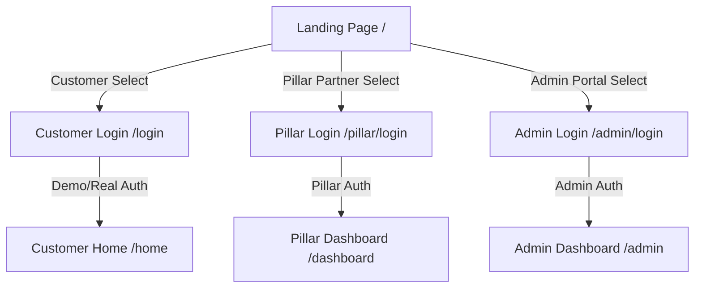

# COOP HUB — Unified Platform Project Handoff Documentation

Welcome to **COOP HUB**, a unified react-based service platform connecting **Customers**, **Pillar Partners** (technicians), and **Admins**. 

This document serves as a complete development, architectural, and deployment handoff guide.

---

## 1. Directory & System Architecture

COOP HUB runs on a single React frontend powered by **Vite**, **Tailwind CSS**, and **Supabase**.

```text
src/
├── components/          # Shared components
│   ├── ai/              # Mascot AI and Chat Agent UI
│   │   ├── GlobalHeroAgent.jsx # Field-tracking floating bubble
│   │   └── ChatAgent.jsx       # 24/7 CoopBot Assistant
│   ├── layout/          # Portal layouts (Header, Sidebar)
│   └── ui/              # Buttons, inputs, modals (contains GradientText)
├── context/             # Global states (Auth, Theme)
├── hooks/               # Custom data hooks (useServices, etc.)
├── i18n/                # Multi-language translation setup
├── lib/                 # Supabase Client Initialization
├── modules/             # Admin Module portal layout and pages
├── pages/               # Portal pages divided by roles
│   ├── auth/            # Login, registration, role selection
│   ├── customer/        # Customer-specific dashboards & actions
│   └── pillar/          # Pillar partner-specific dashboard & pages
├── services/            # API & data persistence layers
└── main.jsx             # Entry point wrapping all Providers
```

---

## 2. Credentials & Demo Mode

The application supports a **dual-data system** that switches dynamically between mock data (stored in `localStorage`) and live Supabase queries based on the credentials used to log in.

### Portal Credentials

| Role | Identifier / Email | Password | Demo Storage Flag |
| :--- | :--- | :--- | :--- |
| **Customer** | `customer@coophub.in` | `password123` | `coophub_demo_customer` |
| **Pillar** | `PIL-CHE-042` | `password123` | `coophub_demo_user` |
| **Admin** | `ADM-CHE-001` | `password123` | `coophub_demo_admin` |

- **Demo Credentials**: Automatically injects rich mock data (e.g. active requests like `#REQ-8942`, notifications, chat sessions, support tickets).
- **Live / Real Credentials**: Authenticates directly with Supabase. If real credentials are used, the application fetches real live tables with no mock data displayed.

---

## 3. Global Theme & Brand Colors

The application defaults to a **Light Theme** on first load across all three portals. The brand colors have been standardized globally in `tailwind.config.js` and `src/styles/variables.css` to match the Pillar Portal's guide:
- **Primary (Dark Navy)**: `#050B14`
- **Secondary (Navy)**: `#0B1628` / `#111827`
- **Accent (Orange)**: `#FF7A00`
- **Background**: `#F5F7FA`

---

## 4. Brand Header Component (`GradientText`)

The main application header displayed inside all dashboard sidebars (Customer, Pillar, and Admin) uses the copy-pasteable **React Bits `GradientText`** component. It animates the brand name `"COOP HUB"` with an orange and white sweep gradient.

---

## 5. Cross-Portal Connectivity & Routing

Portals are fully interconnected via a central landing page `/` and cross-links on each login screen.

### Navigation Hierarchy



- **Resetting State**: Logging out of any portal clears its respective demo flags and redirects the user back to the landing page `/`.

---

## 6. AI Assistant & Mascot Integration

### 🤖 Mascot Hero AI (`GlobalHeroAgent.jsx`)
- Positioned dynamically at the bottom-left of the viewport.
- Focus-tracks input fields on login, registration, and forms.
- **Sidebar Integration**: Nested directly inside the navigation sidebar component right above the Logout block. Configured via the `inline={true}` prop to render as a compact, premium card.
- **Auto-Destruction**: The floating instance automatically self-destructs (returns `null`) on portal routes where the sidebar layout is active, avoiding visual overlap.
- Speaks contextual tips, validation feedback, and errors with high bubble contrast and customizable Text-to-Speech (TTS).

### 💬 CoopBot Chat Assistant (`ChatAgent.jsx`)
- Positioned at the bottom-right of the viewport.
- Features a **Local Intent Router** that catches common customer requests:
  - **Plumbing / Leaks**: Prompts navigation to plumbing booking.
  - **AC Repair**: Prompts navigation to AC service.
  - **Electrical**: Prompts navigation to electrical service.
  - **Tracking requests**: Navigates to `/requests`.
  - **Support**: Navigates to `/support`.
- Renders **Contextual Action Buttons** inside the message bubbles for interactive, single-click navigation.
- Falls back to the backend `/api/ai/chat` for unhandled queries.

---

## 7. How to Run Locally

### Environment Setup
Create a `.env` file in the project root:
```env
VITE_SUPABASE_URL=your_supabase_url
VITE_SUPABASE_ANON_KEY=your_supabase_anon_key
```

### Build & Run Commands
```bash
# Install dependencies
npm install

# Run the local Vite dev server
npm run dev

# Build the production bundle
npm run build

# Preview production build locally
npm run preview
```
